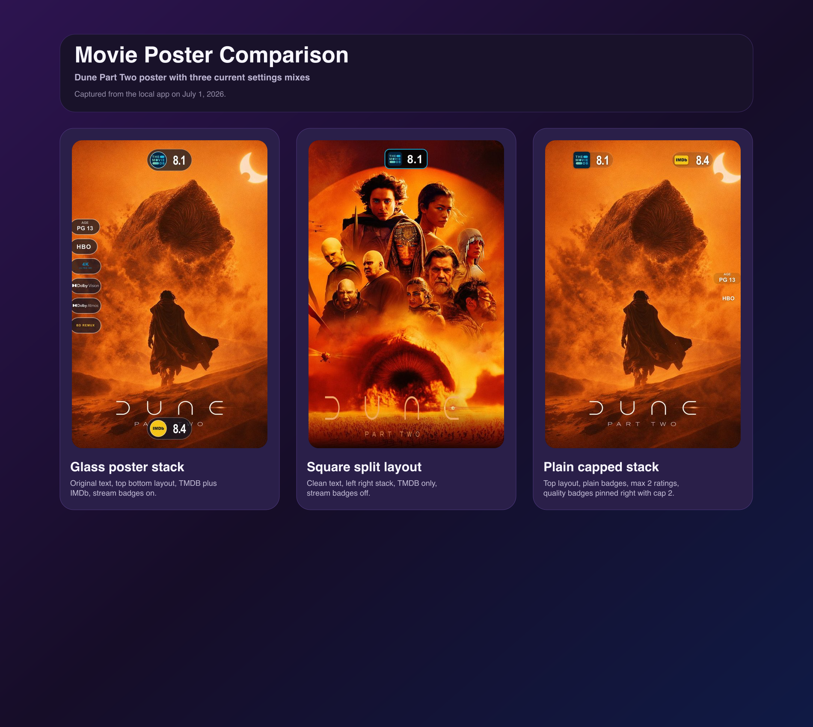
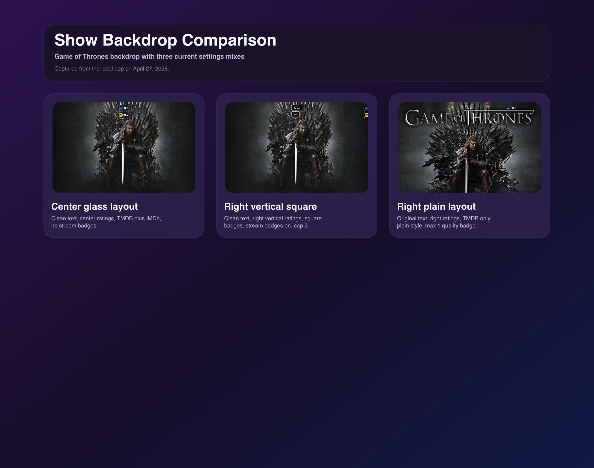
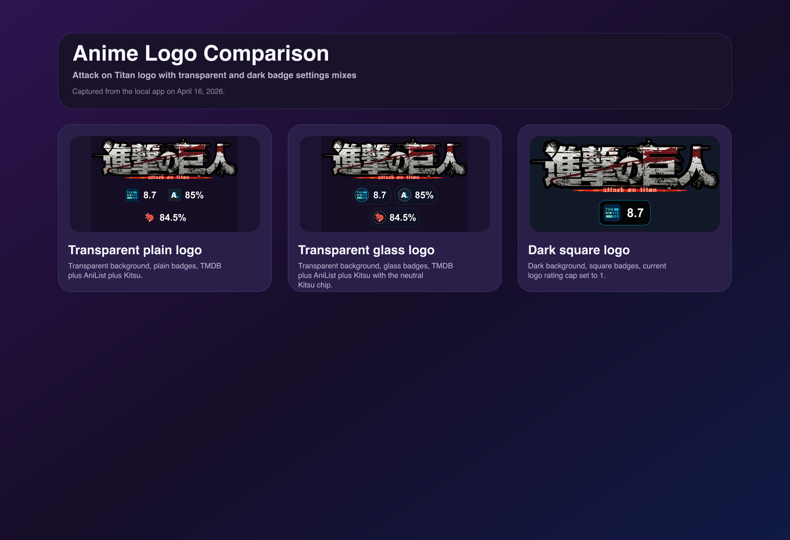
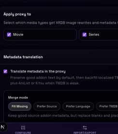
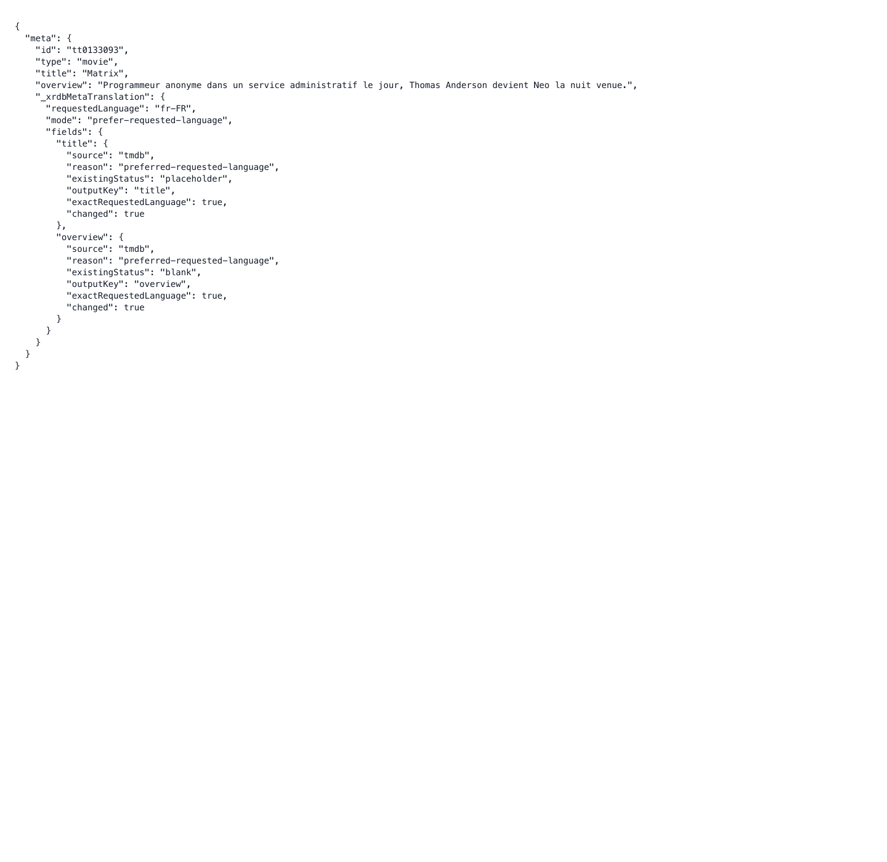
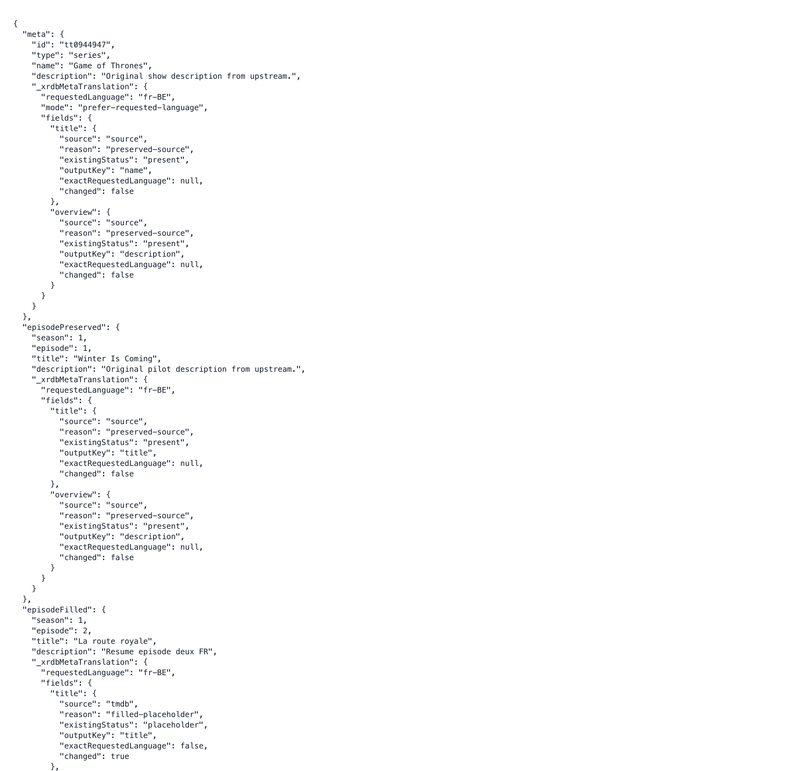
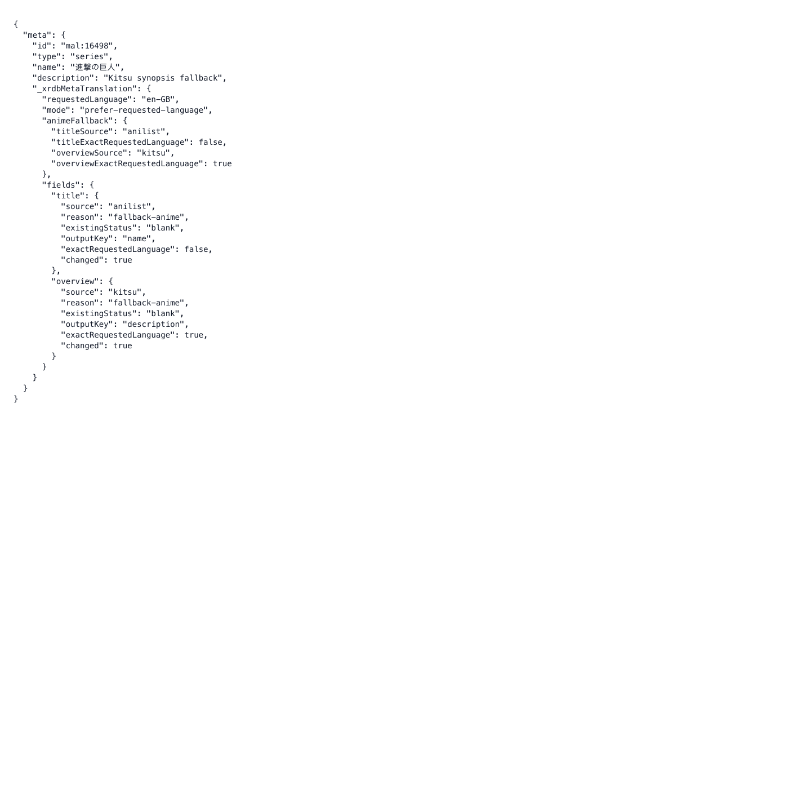
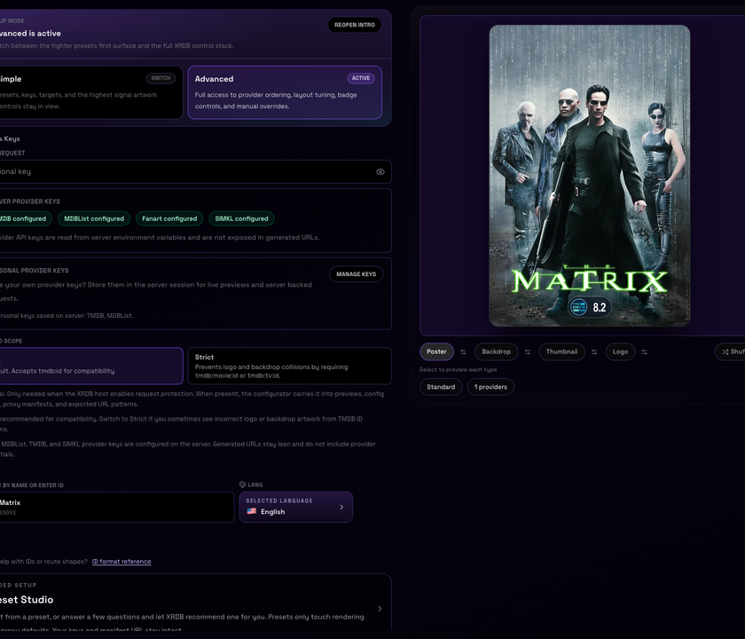
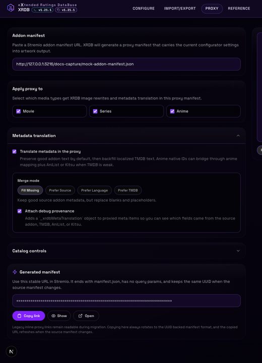

# XRDB: eXtended Ratings DataBase

XRDB, eXtended Ratings DataBase, generates poster, backdrop, thumbnail, and logo artwork with dynamic ratings, quality badges, and export ready integrations.

> [!NOTE]
> XRDB, eXtended Ratings DataBase, is built by IbbyLabs for artwork workflows, media tools, and addon integrations.

<!-- changelog-links:start -->

> [!TIP]
> **Changelog:** read the [full changelog](CHANGELOG.md) or jump straight to the [latest entry](CHANGELOG.md#v1-21-2).

<!-- changelog-links:end -->

## Priorities

Current priorities for XRDB, eXtended Ratings DataBase:

1. Better quality badges from more providers, not only one source.
2. Smarter fallback so images still load when one provider is slow or down.
3. UUID saved profiles with password protected restore so settings can be reopened on any device.
4. Cache warming for startup and background updates so popular content is ready faster.
5. Poster cache warming controls to reduce first load delay.
6. More control for output sizes for poster backdrop and logo.
7. Ongoing speed and reliability work for public and private setups.

### Release approach

1. Release work in clear stages.
2. Use safe rollout switches for risky changes.
3. Verify both movie and series flows before release.
4. Track speed and error rates after each stage.
5. Keep rollback paths simple.

## Quick Start

## Install From GitHub

```bash
git clone https://github.com/IbbyLabs/XRDB
cd XRDB
```

Use Node 22.x locally. The repo now includes `.nvmrc` and `.node-version` so native packages such as `better-sqlite3` stay aligned with CI and release scripts.
Doc refresh and release scripts now run an automatic native dependency preflight for `better-sqlite3` and attempt remediation when a Node ABI mismatch is detected.

1. Install dependencies: `sudo npm install`
2. Build: `npm run build`
3. Start the app: `npm run start`
4. App available at `http://localhost:3000`

## Server Managed API Keys

XRDB uses server side provider keys by default. Configure TMDB and MDBList on the server, then use the configurator without pasting provider credentials into the browser:

1. Provider keys stay in server environment variables.
2. Generated image URLs, config strings, and addon proxy references omit embedded credentials when the server key exists, and masked configurator exports omit `xrdbKey` too.
3. The server falls back to those configured keys whenever `tmdbKey`, `mdblistKey`, `fanartKey`, or `simklClientId` is not present on an incoming request.

This keeps setup simple for shared hosts and avoids exposing provider keys or XRDB request keys in the UI or copied URLs. Request protection still uses the separate optional XRDB request key.

The configurator includes an Import/Export view built around password protected UUID saved profiles. Save a profile once, use Open saved profile on another device, or paste a `?config=<uuid>` link back into the configurator to reopen that same server stored setup. When a protected profile is active, AIOMetadata exports default to lean UUID backed links while inline parameter URLs remain available as an advanced fallback. The `Hide credentials` toggle masks displayed AIOMetadata patterns with placeholders without changing live XRDB request URLs. The `Poster ID source` selector controls whether poster URLs use auto mode (typed TMDB IDs for the broadest coverage), explicit TMDB, or IMDb IDs for compatibility. Background and logo patterns always use type aware TMDB IDs, and episode thumbnails use the selected episode ID mode with season and episode placeholders plus their own thumbnail scoped ratings, artwork, text, and layout settings.

Server side client ids can extend a few providers. `XRDB_MAL_CLIENT_ID` enables the official MyAnimeList API path for direct `myanimelist` ratings, `XRDB_TRAKT_CLIENT_ID` enables direct `trakt` ratings, and `SIMKL_CLIENT_ID` (or `XRDB_SIMKL_CLIENT_ID`) enables direct `simkl` ratings server wide. When the MAL client id is not configured, XRDB falls back to Jikan for direct `myanimelist` lookups before falling back to MDBList whenever an MDBList key is available. Fanart backed artwork can use `XRDB_FANART_API_KEY` or `FANART_API_KEY`. OMDb poster lookups use the server side `OMDB_KEY` by default and also accept `OMDB_API_KEY` or `XRDB_OMDB_API_KEY`.

For `simkl`, XRDB resolves a Simkl item id using `https://api.simkl.com/redirect` and then loads the summary from `https://api.simkl.com/movies/{id}`, `https://api.simkl.com/tv/{id}`, or `https://api.simkl.com/anime/{id}` based on media type hints. Every Simkl request includes `client_id`, `app-name`, and `app-version` query parameters, plus `simkl-api-key` and a browser style `User-Agent` header.

## Live Preview Gallery

These are live requests against production so readers can see current poster, backdrop, and logo output directly inside GitHub.

The gallery can use the optional server side preview env vars `XRDB_README_PREVIEW_TMDB_KEY` and `XRDB_README_PREVIEW_MDBLIST_KEY` when you want isolated preview traffic. Otherwise it falls back to the main server TMDB credential so the README does not need to expose a raw API key.

The doc refresh and release workflows rotate through a curated, varied set of preview cards. Each preview URL includes a `cb` cache buster token so GitHub fetches the current release selection.

### Posters

<table>
  <tr>
    <td><strong>Attack on Titan</strong><br>Japanese text, TMDB / MyAnimeList / AniList / Kitsu, top and bottom rows</td>
    <td><strong>Dune Part Two</strong><br>Square ratings, TMDB / Rotten Tomatoes / Metacritic / Letterboxd, clean text, split side layout</td>
    <td><strong>Stranger Things</strong><br>French text, glass ratings, TMDB / IMDb / Rotten Tomatoes / Metacritic User, stream badges, bottom row layout</td>
    <td><strong>Game of Thrones</strong><br>Plain ratings, TMDB / IMDb / Trakt / Metacritic, split side layout, detached age rating</td>
  </tr>
  <tr>
    <td><a href="https://xrdb.ibbylabs.dev/preview/attack-on-titan-poster?cb=readme-preview-attack-on-titan-poster-v1-21-2"></a></td>
    <td><a href="https://xrdb.ibbylabs.dev/preview/dune-part-two-poster?cb=readme-preview-dune-part-two-poster-v1-21-2"></a></td>
    <td><a href="https://xrdb.ibbylabs.dev/preview/stranger-things-poster?cb=readme-preview-stranger-things-poster-v1-21-2"></a></td>
    <td><a href="https://xrdb.ibbylabs.dev/preview/game-of-thrones-poster?cb=readme-preview-game-of-thrones-poster-v1-21-2"></a></td>
  </tr>
</table>

### Backdrops

<table>
  <tr>
    <td><strong>Attack on Titan</strong><br>Japanese text, TMDB / MyAnimeList / AniList / Kitsu, centered stack</td>
    <td><strong>The Boys</strong><br>Plain ratings, TMDB / IMDb / Trakt / Roger Ebert, centered stack, original text</td>
    <td><strong>Stranger Things</strong><br>Square ratings, TMDB / Rotten Tomatoes / Metacritic / Letterboxd, stream badges, right side stack</td>
  </tr>
  <tr>
    <td><a href="https://xrdb.ibbylabs.dev/preview/attack-on-titan-backdrop?cb=readme-preview-attack-on-titan-backdrop-v1-21-2"></a></td>
    <td><a href="https://xrdb.ibbylabs.dev/preview/the-boys-backdrop?cb=readme-preview-the-boys-backdrop-v1-21-2"></a></td>
    <td><a href="https://xrdb.ibbylabs.dev/preview/stranger-things-backdrop?cb=readme-preview-stranger-things-backdrop-v1-21-2"></a></td>
  </tr>
</table>

### Logos

<table>
  <tr>
    <td><strong>Dune Part Two</strong><br>Dark canvas, square ratings, TMDB / Rotten Tomatoes / Metacritic / Letterboxd</td>
    <td><strong>Attack on Titan</strong><br>Japanese text, TMDB / MyAnimeList / AniList / Kitsu, transparent canvas</td>
    <td><strong>Game of Thrones</strong><br>French text, plain ratings, TMDB / IMDb / Trakt / Metacritic, transparent canvas</td>
  </tr>
  <tr>
    <td><a href="https://xrdb.ibbylabs.dev/preview/dune-part-two-logo?cb=readme-preview-dune-part-two-logo-v1-21-2"></a></td>
    <td><a href="https://xrdb.ibbylabs.dev/preview/attack-on-titan-logo?cb=readme-preview-attack-on-titan-logo-v1-21-2"></a></td>
    <td><a href="https://xrdb.ibbylabs.dev/preview/game-of-thrones-logo?cb=readme-preview-game-of-thrones-logo-v1-21-2"></a></td>
  </tr>
</table>
## Rendering Option Comparisons

These static comparison boards highlight the newer rendering controls that are easier to evaluate side by side than in a single live card. They cover `logoBackground`, `logoRatingsMax`, `posterQualityBadgesMax`, `backdropQualityBadgesMax`, and a few layout and style combinations from the local March 27, 2026 build.

The current quality badge behavior uses local asset based artwork for 4K, Bluray, HDR10, Dolby Vision, and Dolby Atmos. Certification badges also include a small `AGE` label above the rating so age ratings read more clearly at a glance, and poster layouts can pin that certification badge to supported top, bottom, left, or right anchors independently from the rest of the quality badge row.

Transparent provider icons now stay transparent across every badge style. In `glass`, icons with transparency such as Kitsu render on a neutral inner chip with an accent ring so the accent color does not bleed through the icon cutouts.

### Movie Poster Options

<p align="center">
  
</p>

### Show Backdrop Options

<p align="center">
  
</p>

### Anime Logo Options

<p align="center">
  
</p>

## Scalability & Docker

The repo now ships two Docker entrypoints:

- [compose.yaml](/Users/ibby/Applications/xrdb/compose.yaml) is the VPS stack file. It matches the style used by popular Traefik based stacks much more closely: prebuilt GHCR image, `env_file: .env`, `expose`, Traefik labels, profiles, and a shared external Docker network.
- [local-compose.yaml](/Users/ibby/Applications/xrdb/local-compose.yaml) is the local source build file. It keeps the simpler direct port mapping path for local testing.

Sources:
- https://github.com/Viren070/docker-compose-template
- https://raw.githubusercontent.com/Viren070/docker-compose-template/main/apps/aiometadata/compose.yaml
- https://raw.githubusercontent.com/Viren070/docker-compose-template/main/apps/aiostreams/compose.yaml
- https://raw.githubusercontent.com/Viren070/docker-compose-template/main/apps/stremio-ai-search/compose.yaml
- https://raw.githubusercontent.com/Viren070/docker-compose-template/main/apps/mediaflow-proxy/compose.yaml

## Releases & Packages

Pushing a version tag that matches `v*` now starts two independent workflows:

- publishes a GitHub release with notes sourced from the matching changelog entry
- pushes a multi architecture container image to GHCR as `ghcr.io/ibbylabs/xrdb`

The GitHub release is no longer blocked on the Docker publish job finishing.

Pull examples:

```bash
docker pull ghcr.io/ibbylabs/xrdb:latest
docker pull ghcr.io/ibbylabs/xrdb:v1.0.0
```

Release flow:

```bash
npm run release:patch
npm run release:minor
npm run release:major
```

The release flow also bumps `FINAL_IMAGE_RENDERER_CACHE_VERSION` automatically so each new release invalidates stale final image renders on first request.
Release automation now regenerates every tracked README doc image and CI fails if the checked in doc assets drift from the generator output.
If native `better-sqlite3` binaries are out of sync with your local Node runtime, the release flow attempts automatic remediation before running refresh and release steps.

Store `XRDB_README_PREVIEW_TMDB_KEY` and `XRDB_README_PREVIEW_MDBLIST_KEY` in local `.env` or `.env.local` if you want isolated preview traffic for the release/doc asset scripts. Otherwise the preview flow can use the main server TMDB credential automatically. Shell exported vars still win if both are set.

If the GHCR package already existed before it was linked to this repository, open the package in GitHub and:

1. connect it to `IbbyLabs/XRDB`
2. allow the package to follow repository permissions
3. set visibility to public if you want anonymous pulls

## Recommended Requirements

For high performance (on the fly image rendering), a server with a strong CPU and plenty of RAM is recommended.

Minimum recommended:
- CPU: 4 vCPU
- RAM: 4 GB

Environment templates:
- `env.selfhost.template` is the minimal self host setup.
- `env.template` is the full reference with every supported option.

Quick start with the minimal template:
```bash
cp env.selfhost.template .env
```

Use the full template instead:
```bash
cp env.template .env
```

Local source build:
```bash
npm run docker:up
```

Explicit local source build:
```bash
npm run docker:up:local
```

VPS stack start:
```bash
npm run docker:up:stack
```

The VPS stack file expects Traefik or another external reverse proxy in front of it. It uses the published image and does not bind a public port directly.

If you use a Traefik style stack, set:

```env
XRDB_HOSTNAME=xrdb.example.com
DOCKER_NETWORK=aio_default
DOCKER_NETWORK_EXTERNAL=true
DOCKER_DATA_DIR=/opt/docker/data
```

That makes the VPS file mount `/opt/docker/data/xrdb` into `/app/data`, which is closer to the template repo shape.

If you route XRDB through gluetun in your own stack, set:

```env
HTTP_PROXY=http://gluetun:8080
HTTPS_PROXY=http://gluetun:8080
```

The repo compose file does not hard wire a `gluetun` dependency because that service usually lives in the surrounding VPS stack instead of the app repo itself.

Local custom port:
```bash
XRDB_PORT=4000 docker compose -f local-compose.yaml up -d --build
```

### Authelia

If you run XRDB behind Authelia you need to bypass authentication for the image
and proxy endpoints so Stremio, Jellyfin, and other clients can still fetch
posters. The repo ships an
[authelia-rules.template.yaml](authelia-rules.template.yaml) with the bypass
rule and step by step instructions for both the Viren070 template and custom
setups.

**Viren070 template users** — add `TEMPLATE_XRDB_HOSTNAME: ${XRDB_HOSTNAME?}`
to your Authelia compose environment, paste the bypass rule from the template
into `configuration.yml` before the wildcard catch-all, and add
`authelia@docker` to the XRDB router labels. The existing `*.DOMAIN`
two_factor catch-all protects the configurator UI automatically.

**Standalone / custom setups:**

1. Add `TEMPLATE_XRDB_HOSTNAME` to your Authelia environment (set it to your
   XRDB hostname).
2. Copy the `access_control` rule from the template into your Authelia
   `configuration.yml`.
3. Uncomment the Authelia middleware label in `compose.yaml` (or add it
   manually):
   ```yaml
   - "traefik.http.routers.xrdb.middlewares=authelia@docker"
   ```

The template bypasses `/poster`, `/backdrop`, `/logo`, `/thumbnail`, `/proxy`,
`/api`, `/preview`, and Next.js static assets. Everything else (the
configurator UI, reference page) is protected by your default policy. Image and
proxy routes remain independently gated by `XRDB_REQUEST_API_KEY`.

### Public Fast Preset

If you run a shared or public XRDB host, start from a lighter profile before
adding more providers or Torrentio badges. This keeps cold renders and Stremio
catalog bursts predictable.

Host env preset:

```env
XRDB_SHARP_CONCURRENCY=4
XRDB_SHARP_CACHE_MEMORY_MB=512
XRDB_SHARP_CACHE_ITEMS=2000
XRDB_SHARP_CACHE_FILES=20000
XRDB_TORRENTIO_CACHE_TTL_MS=43200000
XRDB_TORRENTIO_CONCURRENCY=3
```

Recommended proxy or addon settings:

| Setting | Recommended Value | Why |
|---------|-------------------|-----|
| `posterRatings` | `imdb,tmdb,mdblist` | Good coverage without fetching a long tail of providers on every poster. |
| `backdropRatings` | `imdb,tmdb,mdblist` | Same tradeoff as posters. |
| `logoRatings` | `imdb,tmdb` | Logos usually benefit less from a dense rating stack. |
| `posterStreamBadges` | `off` | Torrentio calls are one of the largest latency spikes on public instances. |
| `backdropStreamBadges` | `off` | Same reason as posters. |
| `translateMeta` | `true` | Keeps proxy metadata improvements on. |
| `translateMetaMode` | `fill-missing` | Conservative proxy behavior that usually helps more than it hurts. |
| `debugMetaTranslation` | `false` | Debug provenance is useful for troubleshooting, but not for normal public traffic. |

If you want the absolute fastest public profile, drop `mdblist` too and keep
the ratings list to `imdb,tmdb`.

## API Usage

Main image endpoint:
`GET /{type}/{id}.jpg?ratings={providers}&lang={lang}&ratingStyle={style}...`

Episode thumbnail endpoint:
`GET /thumbnail/{id}/S{season}E{episode}.jpg?thumbnailRatings=tmdb,imdb&lang={lang}...`

Response format note:
- Poster and backdrop responses are returned as JPEG.
- Logo requests keep the `.jpg` route shape but may return PNG when transparency is preserved.

### Examples
- **Poster with IMDb and TMDB**: `/poster/tt0133093.jpg?ratings=imdb,tmdb&lang=en`
- **Plain backdrop**: `/backdrop/tmdb:movie:603.jpg?ratings=mdblist&style=plain&backdropRatingsLayout=right vertical`
- **Backdrop with Bottom Row**: `/backdrop/tmdb:tv:1399.jpg?backdropRatings=tmdb,imdb&backdropBottomRatingsRow=true&lang=en`
- **Episode thumbnail with XRDBID**: `/thumbnail/xrdbid:tt0944947/S01E01.jpg?thumbnailRatings=tmdb,imdb&lang=en`

Episode thumbnails use the dedicated `/thumbnail/{id}/S{season}E{episode}.jpg` route. They keep their own thumbnail scoped controls for ratings, style, presentation, artwork source, episode artwork mode, image text, layout, badge sizing, quality badges, and side stack placement. Rating badge scale stays type scoped across poster, backdrop, thumbnail, and logo outputs, and every artwork type now supports the same `70-200` range. `thumbnailRatings` defaults to `tmdb,imdb`.

The configurator preview type row now includes a sync control beside each type. You can sync the active type to one target, sync to all targets, or pull settings from another type before applying the diff. Sync keeps type safety intact: poster only presentations such as `ring`, `editorial`, and `blockbuster` are coerced to `standard` on backdrop, thumbnail, and logo targets, thumbnail sync keeps only episode safe rating providers, and logo sync does not carry stream badges.

### Supported Query Parameters

| Parameter | Description | Supported Values | Default |
|-----------|-------------|------------------|---------|
| `type` | Image type (Path) | `poster`, `backdrop`, `logo` (`thumbnail` uses its own route) | - |
| `id` | Media ID (Path) | IMDb (`tt...`), TMDB (`tmdb:id`, `tmdb:movie:id`, `tmdb:tv:id`), Kitsu (`kitsu:id`), anime IDs such as `anilist:123`, `mal:456`, `tvdb:12345`, or `anidb:6789` | - |
| `tmdbIdScope` | TMDB ID collision handling mode | `soft`, `strict` | `soft` |
| `config` | Saved config profile ID. Loads encrypted server stored params as base defaults; explicit URL params take precedence. Create or reopen password protected UUID profiles from the Import/Export view in the configurator. | String (e.g. `550e8400-e29b-41d4-a716-446655440000`) | - |
| `lang` | Image language | Any TMDB ISO 639-1 code (e.g. `it`, `en`, `es`, `fr`, `de`, `ru`, `ja`) | `en` |
| `genreBadge` | Genre badge mode (global fallback) | `off`, `text`, `icon`, `both` | `off` |
| `posterGenreBadge` | Poster genre badge mode | `off`, `text`, `icon`, `both` | `off` |
| `backdropGenreBadge` | Backdrop genre badge mode | `off`, `text`, `icon`, `both` | `off` |
| `logoGenreBadge` | Logo genre badge mode | `off`, `text`, `icon`, `both` | `off` |
| `genreBadgeStyle` | Genre badge style (global fallback) | `glass`, `square`, `plain`, `clean` | `glass` |
| `posterGenreBadgeStyle` | Poster genre badge style | `glass`, `square`, `plain`, `clean` | `glass` |
| `backdropGenreBadgeStyle` | Backdrop genre badge style | `glass`, `square`, `plain`, `clean` | `glass` |
| `logoGenreBadgeStyle` | Logo genre badge style | `glass`, `square`, `plain`, `clean` | `glass` |
| `genreBadgePosition` | Genre badge anchor (global fallback) | `topLeft`, `topCenter`, `topRight`, `bottomLeft`, `bottomCenter`, `bottomRight` | `topLeft` |
| `posterGenreBadgePosition` | Poster genre badge anchor | `topLeft`, `topCenter`, `topRight`, `bottomLeft`, `bottomCenter`, `bottomRight` | `topLeft` |
| `backdropGenreBadgePosition` | Backdrop genre badge anchor | `topLeft`, `topCenter`, `topRight`, `bottomLeft`, `bottomCenter`, `bottomRight` | `topLeft` |
| `logoGenreBadgePosition` | Logo genre badge anchor | `topLeft`, `topCenter`, `topRight`, `bottomLeft`, `bottomCenter`, `bottomRight` | `topLeft` |
| `genreBadgeScale` | Genre badge scale (global fallback) | Number (`70-200`) | `100` |
| `posterGenreBadgeScale` | Poster genre badge scale | Number (`70-200`) | `100` |
| `backdropGenreBadgeScale` | Backdrop genre badge scale | Number (`70-200`) | `100` |
| `logoGenreBadgeScale` | Logo genre badge scale | Number (`70-200`) | `100` |
| `genreBadgeBorderWidth` | Genre badge accent stroke width for `glass` style (global fallback). `0` disables the stroke. | Number (`0-10`) | `1.4` |
| `posterGenreBadgeBorderWidth` | Poster genre badge border width | Number (`0-10`) | `1.4` |
| `backdropGenreBadgeBorderWidth` | Backdrop genre badge border width | Number (`0-10`) | `1.5` |
| `thumbnailGenreBadgeBorderWidth` | Thumbnail genre badge border width | Number (`0-10`) | `1.5` |
| `logoGenreBadgeBorderWidth` | Logo genre badge border width | Number (`0-10`) | `1.4` |
| `genreBadgeBackgroundOpacity` | Clean style genre badge background opacity (global fallback). `0` is transparent and `100` is fully opaque. | Number (`0-100`) | `28` |
| `posterGenreBadgeBackgroundOpacity` | Poster clean style genre badge background opacity | Number (`0-100`) | `28` |
| `backdropGenreBadgeBackgroundOpacity` | Backdrop clean style genre badge background opacity | Number (`0-100`) | `28` |
| `thumbnailGenreBadgeBackgroundOpacity` | Thumbnail clean style genre badge background opacity | Number (`0-100`) | `28` |
| `logoGenreBadgeBackgroundOpacity` | Logo clean style genre badge background opacity | Number (`0-100`) | `28` |
| `posterNoBackgroundBadgeOutlineColor` | Text stroke colour for `plain` style genre badge on poster | Hex colour (e.g. `#000000`) | `#000000` |
| `posterNoBackgroundBadgeOutlineWidth` | Text stroke width for `plain` style genre badge on poster. `0` disables the stroke. | Number (`0-10`) | `0` |
| `streamBadges` | Quality badges via Torrentio (global fallback) | `auto`, `on`, `off` | `auto` |
| `posterStreamBadges` | Poster quality badges. `auto` warms in the background and does not block cold poster renders. | `auto`, `on`, `off` | `off` |
| `backdropStreamBadges` | Backdrop quality badges | `auto`, `on`, `off` | `auto` |
| `qualityBadgesSide` | Quality badges side (poster `top bottom` layout only) | `left`, `right` | `left` |
| `posterQualityBadgesPosition` | Quality badges side for poster `top` or `bottom` layouts | `auto`, `left`, `right` | `auto` |
| `ageRatingBadgePosition` | Standalone age rating position for supported poster layout anchor families | `inherit`, `top-left`, `top-center`, `top-right`, `bottom-left`, `bottom-center`, `bottom-right`, `left-top`, `left-center`, `left-bottom`, `right-top`, `right-center`, `right-bottom` | `inherit` |
| `qualityBadgesStyle` | Quality badges style (global fallback) | `glass`, `square`, `plain`, `media`, `silver` | `glass` |
| `posterQualityBadgesStyle` | Poster quality badges style | `glass`, `square`, `plain`, `media`, `silver` | `glass` |
| `backdropQualityBadgesStyle` | Backdrop quality badges style | `glass`, `square`, `plain`, `media`, `silver` | `glass` |
| `posterRatingBadgeScale` | Poster rating badge scale | Number (`70-200`) | `100` |
| `backdropRatingBadgeScale` | Backdrop rating badge scale | Number (`70-200`) | `100` |
| `thumbnailRatingBadgeScale` | Thumbnail rating badge scale | Number (`70-200`) | `100` |
| `logoRatingBadgeScale` | Logo rating badge scale | Number (`70-200`) | `100` |
| `posterQualityBadgeScale` | Poster quality badge scale | Number (`70-200`) | `100` |
| `backdropQualityBadgeScale` | Backdrop quality badge scale | Number (`70-200`) | `100` |
| `thumbnailQualityBadgeScale` | Thumbnail quality badge scale | Number (`70-200`) | `100` |
| `logoQualityBadgeScale` | Logo quality badge scale | Number (`70-200`) | `100` |
| `posterQualityBadgesMax` | Poster quality badge limit | Number (1-20) | `auto` |
| `backdropQualityBadgesMax` | Backdrop quality badge limit | Number (1-20) | `auto` |
| `ratingPresentation` | Rating presentation mode (global fallback). `none` disables rating badges, aggregate overlays, provider overlays, and stream badges. | `standard`, `minimal`, `average`, `dual`, `dual-minimal`, `editorial`, `ring`, `blockbuster`, `none` | `standard` |
| `aggregateRatingSource` | Aggregate source for `minimal` and `average` (global fallback) | `overall`, `critics`, `audience` | `overall` |
| `posterRingValueSource` | Center score source for poster Compact Ring | `overall`, `critics`, `audience`, `priority-critics`, `priority-audience`, `highest`, or any rating provider | `highest` |
| `posterRingProgressSource` | Progress stroke source for poster Compact Ring | `overall`, `critics`, `audience`, `priority-critics`, `priority-audience`, `highest`, or any rating provider | `tmdb` |
| `posterRingCriticsPriority` | Critics lane Compact Ring priority order | Comma separated rating providers, up to 3 | `tomatoes,metacritic,imdb` |
| `posterRingAudiencePriority` | Audience lane Compact Ring priority order | Comma separated rating providers, up to 3 | `tomatoesaudience,imdb,tmdb` |
| `aggregateAccentMode` | Aggregate accent source — also controls Compact Ring stroke color | `source`, `genre`, `custom`, `dynamic` | `source` |
| `aggregateAccentColor` | Aggregate accent color when `aggregateAccentMode=custom` | Hex color | `#a78bfa` |
| `aggregateAccentBarOffset` | Average badge accent bar offset | Number (-12 to 12) | `0` |
| `aggregateValueColor` | Rating value text color (global fallback) | Hex color | `#ffffff` |
| `aggregateCriticsValueColor` | Critics rating value text color override | Hex color | `#ffffff` |
| `aggregateAudienceValueColor` | Audience rating value text color override | Hex color | `#ffffff` |
| `ratingXOffsetPillGlass` | X offset for stacked Pill Glass badge layouts | Number (-320 to 320) | `0` |
| `ratingYOffsetPillGlass` | Y offset for stacked Pill Glass badge layouts | Number (-320 to 320) | `0` |
| `ratingXOffsetSquare` | X offset for stacked Square Dark badge layouts | Number (-320 to 320) | `0` |
| `ratingYOffsetSquare` | Y offset for stacked Square Dark badge layouts | Number (-320 to 320) | `0` |
| `ratings` | Rating providers (global fallback) | `tmdb, mdblist, imdb, allocine, allocinepress, tomatoes, tomatoesaudience, letterboxd, metacritic, metacriticuser, trakt, simkl, rogerebert, myanimelist, anilist, kitsu` | `all` |
| `posterRatings` | Poster rating providers | `tmdb, mdblist, imdb, allocine, allocinepress, tomatoes, tomatoesaudience, letterboxd, metacritic, metacriticuser, trakt, simkl, rogerebert, myanimelist, anilist, kitsu` | `all` |
| `backdropRatings` | Backdrop rating providers | `tmdb, mdblist, imdb, allocine, allocinepress, tomatoes, tomatoesaudience, letterboxd, metacritic, metacriticuser, trakt, simkl, rogerebert, myanimelist, anilist, kitsu` | `all` |
| `thumbnailRatings` | Episode thumbnail rating providers | `tmdb, imdb` | `tmdb,imdb` |
| `logoRatings` | Logo rating providers | `tmdb, mdblist, imdb, allocine, allocinepress, tomatoes, tomatoesaudience, letterboxd, metacritic, metacriticuser, trakt, simkl, rogerebert, myanimelist, anilist, kitsu` | `all` |
| `ratingValueMode` | Rating display scaling | `native`, `normalized`, `normalized100` | `native` |
| `ratingStyle` (or `posterRatingStyle` / `backdropRatingStyle` / `thumbnailRatingStyle` / `logoRatingStyle`, or `style` legacy) | Badge style | `glass` (Pill), `square` (Dark), `plain` (No BG), `stacked` | `glass` (poster/backdrop/thumbnail), `plain` (logo) |
| `tmdbKey` | Optional TMDB v3 API key override | String | Server TMDB credential via `XRDB_TMDB_READ_ACCESS_TOKEN` or `XRDB_TMDB_API_KEY` |
| `mdblistKey` | Optional MDBList API key override | String | Server `MDBLIST_API_KEY` / `MDBLIST_API_KEYS` |
| `fanartKey` | Optional Fanart API key override for fanart poster, backdrop, and logo sources | String | Server `XRDB_FANART_API_KEY` |
| `simklClientId` | Optional SIMKL client id override for direct SIMKL ratings | String | Server `SIMKL_CLIENT_ID` |
| `imageText` | Image text (global fallback for poster/backdrop/thumbnail) | `original`, `clean`, `textless`, `alternative`, `random` | `original` (poster), `clean` (backdrop/thumbnail) |
| `posterArtworkSource` | Poster artwork source | `tmdb`, `fanart`, `cinemeta`, `omdb`, `random`, `blackbar` | `tmdb` |
| `backdropArtworkSource` | Backdrop artwork source | `tmdb`, `fanart`, `cinemeta`, `random`, `blackbar` | `tmdb` |
| `posterRatingsLayout` | Poster layout | `top`, `bottom`, `left`, `right`, `top bottom`, `left right` | `top bottom` |
| `posterRatingsMaxPerSide` | Max badges per side | Number (1+) | `auto` |
| `backdropRatingsLayout` | Backdrop layout | `center`, `right`, `right vertical` | `center` |
| `backdropBottomRatingsRow` | Force backdrop ratings into one Bottom Row | `true`, `false` | `false` |
| `logoRatingsMax` | Logo badge limit | Number (1+) | `auto` |
| `logoBottomRatingsRow` | Force logo ratings into one Bottom Row | `true`, `false` | `false` |
| `logoBackground` | Logo canvas background | `transparent`, `dark` | `transparent` |
| `logoArtworkSource` | Logo artwork source | `tmdb`, `fanart`, `cinemeta`, `random` | `tmdb` |
| `sideRatingsPosition` | Side stack vertical anchor (global fallback) | `top`, `middle`, `bottom`, `custom` | `top` |
| `posterSideRatingsPosition` | Poster side stack vertical anchor | `top`, `middle`, `bottom`, `custom` | `top` |
| `backdropSideRatingsPosition` | Backdrop side stack vertical anchor | `top`, `middle`, `bottom`, `custom` | `top` |
| `sideRatingsOffset` | Side stack custom offset (global fallback) | Number (0-100) | `50` |
| `posterSideRatingsOffset` | Poster side stack custom offset | Number (0-100) | `50` |
| `backdropSideRatingsOffset` | Backdrop side stack custom offset | Number (0-100) | `50` |

Thumbnail scoped query params mirror the configurator controls and keep thumbnail output independent from backdrop output. Rating badge scale remains type scoped across every artwork type even though the supported `70-200` range is now shared:

- `thumbnailGenreBadge`, `thumbnailGenreBadgeStyle`, `thumbnailGenreBadgePosition`, `thumbnailGenreBadgeScale`, `thumbnailGenreBadgeAnimeGrouping`
- `thumbnailStreamBadges`, `thumbnailQualityBadges`, `thumbnailQualityBadgesStyle`, `thumbnailQualityBadgesMax`, `thumbnailQualityBadgeScale`
- `thumbnailRatingStyle`, `thumbnailRatingPresentation`, `thumbnailAggregateRatingSource`, `thumbnailRatingBadgeScale`
- `thumbnailImageText`, `thumbnailArtworkSource`, `thumbnailEpisodeArtwork`
- `thumbnailRatingsLayout`, `thumbnailRatingsMax`, `thumbnailBottomRatingsRow`, `thumbnailSideRatingsPosition`, `thumbnailSideRatingsOffset`

In the configurator UI, `minimal` is labeled as `Compact Average`, `average` is labeled as `Labeled Average`, and `dual` is labeled as `Critics + Audience`. The underlying query values stay `minimal`, `average`, and `dual`.

RPDB compatibility aliases are accepted where they map cleanly in XRDB: `order`/`ratingOrder` (rating provider order), `ratingBarPos` (mapped to poster/backdrop layout + side position), `fontScale` (mapped to rating badge scale), `imageSize=verylarge` (mapped to `posterImageSize=4k`), and `textless`/`posterType=textless-*` (mapped to clean poster text mode).

`myanimelist` and `trakt` can render directly when the server has `XRDB_MAL_CLIENT_ID` or `XRDB_TRAKT_CLIENT_ID`. Without the MAL client id, XRDB falls back to Jikan for direct `myanimelist` ratings. When direct lookups are unavailable, XRDB still falls back to MDBList when an MDBList key is available.

`allocine` and `allocinepress` add AlloCiné audience and press scores for movie and series titles. They render on the native `/5` scale by default and still respect `ratingValueMode` normalization when you want everything shown on a shared `/10` or `/100` scale.

`tmdbIdScope=soft` is the default for compatibility and accepts bare `tmdb:id`. Set `tmdbIdScope=strict` to require `tmdb:movie:id` or `tmdb:tv:id` for backdrop and logo requests to avoid movie versus TV collisions.

Transparent provider icons stay transparent across `glass`, `square`, and `plain`. In `glass`, XRDB switches icons with transparency such as Kitsu to a neutral inner chip with an accent ring to avoid accent color bleed through.

Genre badges resolve from a curated family set that covers every TMDB genre. Strong buckets such as horror, comedy, drama, sci fi, fantasy, crime, documentary, animation, and anime render with dedicated icons. Music, reality, family, history, kids, news, soap, talk, TV movie, and war also have their own badge families. When a title mixes drama with a stronger supported family, XRDB still prefers the more specific bucket. Any genre that does not match a dedicated family falls back to a neutral badge so nothing is missing.

`fanartKey` is optional. XRDB falls back to `XRDB_FANART_API_KEY` or `FANART_API_KEY` when the request does not include one.

Poster sources support `tmdb`, `fanart`, `cinemeta`, `omdb`, `random`, and `blackbar`. `posterArtworkSource=fanart` uses fanart.tv poster art for `original`, `clean`, `textless`, and `alternative`. `clean` and `textless` prefer Fanart posters whose normalized language metadata resolves to textless, then fall back to the normal ranked Fanart order when no textless poster exists. `posterArtworkSource=cinemeta` uses the MetaHub Cinemeta poster when an IMDb id is available, but XRDB skips it whenever the active poster text mode requires textless art. `posterArtworkSource=omdb` uses the OMDb poster when a server OMDb key and IMDb id are available, and it is skipped under the same textless requirement. `posterArtworkSource=random` picks a seeded source across TMDB, fanart, Cinemeta, and OMDb when those candidates exist, and drops unsupported providers whenever `clean`, `textless`, or the random poster text filter requires textless artwork. `posterArtworkSource=blackbar` is a presentation effect: the normal TMDB poster is still fetched as the background, and rating badges are rendered on a solid black strip flush with the image edge. In the configurator UI, black bar is exposed as a toggle in the Presentation section rather than an artwork source option.

Backdrop sources support `tmdb`, `fanart`, `cinemeta`, `random`, and `blackbar`. `backdropArtworkSource=fanart` uses fanart.tv `moviebackground` or `showbackground` art for `original`, `clean`, `textless`, and `alternative`. `clean` and `textless` prefer textless capable Fanart backdrop assets before falling back to the ranked Fanart order. `backdropArtworkSource=cinemeta` uses the MetaHub Cinemeta backdrop when an IMDb id is available, but XRDB skips it whenever the active backdrop text mode requires textless art. `backdropArtworkSource=random` picks a seeded source across TMDB, fanart, and Cinemeta when those candidates exist, and skips unsupported providers whenever textless artwork is required. `backdropArtworkSource=blackbar` is the same presentation effect as the poster variant: normal backdrop artwork is used as the background and badges render on a flush black strip at the bottom edge. Logo sources support `tmdb`, `fanart`, `cinemeta`, and `random`. `logoArtworkSource=fanart` uses fanart.tv HD or clear logo assets for logo output, `logoArtworkSource=cinemeta` uses the MetaHub Cinemeta logo when an IMDb id is available, and `logoArtworkSource=random` picks a seeded source across TMDB, fanart, and Cinemeta when those candidates exist.

Use `backdropBottomRatingsRow=true` or `logoBottomRatingsRow=true` to collapse those badges into one Bottom Row. When the backdrop Bottom Row is enabled, XRDB ignores the saved backdrop side layout and side offset controls for rendering and omits those inactive params from lean exports such as AIOMetadata patterns.

Future work: season aware fanart support is a strong next step for TV because fanart.tv exposes `seasonposter` and `seasonthumb` assets.

Rendered ratings keep provider native scales by default. Set `ratingValueMode=normalized` to convert everything to a 0 to 10 display scale, or `ratingValueMode=normalized100` to convert everything to a rounded whole number out of 100. Providers that already use `/10` are shown without the suffix in ten point mode, percentage sources are converted to decimal (`69%` -> `6.9`) or whole number (`69`), `/5` sources are doubled (`4.2/5` -> `8.4`) or multiplied by twenty (`84`), and `/4` sources are multiplied by `2.5` (`3.5/4` -> `8.8` or `88`).

Episode thumbnails now use the episode level TMDB and IMDb ratings instead of inheriting the parent series rating stack. Keep `thumbnailRatings=tmdb,imdb` if you want the default episode specific pairing.

When no explicit max is set, XRDB now renders all badges that fit the layout instead of applying a fixed poster or logo badge cap. Use the max params only when you want to intentionally tighten the visible badge count.

### Supported ID Formats

XRDB supports multiple formats to identify media:

- **IMDb**: `tt0133093` (standard `tt` + numbers)
- **TMDB**: `tmdb:603` or explicit `tmdb:movie:603` / `tmdb:tv:1399`
- **Kitsu**: `kitsu:1` (prefix `kitsu:` followed by the ID)
- **Anime Mappings**: `provider:id` (e.g. `anilist:123`, `myanimelist:456`)
- **Episode Thumbnails**: `/thumbnail/{episodeBaseId}/S01E01.jpg` where `episodeBaseId` can be plain IMDb, `tmdb:{tmdb_id}`, `xrdbid:{imdb_id}`, `tvdb:{tvdb_id}`, `kitsu:{kitsu_id}`, `anilist:{anilist_id}`, `mal:{mal_id}`, or `anidb:{anidb_id}`

## Addon Developer Guide

To integrate XRDB into your addon:

1. **Config String**: use a single `xrdbConfig` string (base64url) generated by the XRDB configurator. It contains `baseUrl`, `tmdbKey`, `mdblistKey`, optional `fanartKey`, the per type style/text/layout fields, and any optional overrides currently enabled. Defaults are usually omitted.
2. **Addon UI**: show ONLY the toggles to enable/disable `poster`, `backdrop`, `thumbnail`, `logo`. No modal and no extra settings panels.
3. **Fallback**: if a type is disabled, keep the original artwork (do not call XRDB for that type).
4. **Decode**: decode `xrdbConfig` (base64url -> JSON) once and reuse it.
5. **URL build**: use `{baseUrl}/{type}/{id}.jpg` for poster, backdrop, and logo, and use `{baseUrl}/thumbnail/{episodeBaseId}/S{season}E{episode}.jpg` for episode thumbnails. Add `tmdbKey` and `mdblistKey`, then pass through any optional XRDB fields present in `cfg` such as `fanartKey`, `ratings`, `posterRatings`, `backdropRatings`, `thumbnailRatings`, `logoRatings`, `lang`, `ratingValueMode`, `genreBadge`, `genreBadgeStyle`, `genreBadgePosition`, `genreBadgeScale`, `posterGenreBadge`, `backdropGenreBadge`, `thumbnailGenreBadge`, `logoGenreBadge`, `posterGenreBadgeStyle`, `backdropGenreBadgeStyle`, `thumbnailGenreBadgeStyle`, `logoGenreBadgeStyle`, `posterGenreBadgePosition`, `backdropGenreBadgePosition`, `thumbnailGenreBadgePosition`, `logoGenreBadgePosition`, `posterGenreBadgeScale`, `backdropGenreBadgeScale`, `thumbnailGenreBadgeScale`, `logoGenreBadgeScale`, `genreBadgeBorderWidth`, `posterGenreBadgeBorderWidth`, `backdropGenreBadgeBorderWidth`, `thumbnailGenreBadgeBorderWidth`, `logoGenreBadgeBorderWidth`, `genreBadgeBackgroundOpacity`, `posterGenreBadgeBackgroundOpacity`, `backdropGenreBadgeBackgroundOpacity`, `thumbnailGenreBadgeBackgroundOpacity`, `logoGenreBadgeBackgroundOpacity`, `posterNoBackgroundBadgeOutlineColor`, `posterNoBackgroundBadgeOutlineWidth`, `streamBadges`, `posterStreamBadges`, `backdropStreamBadges`, `thumbnailStreamBadges`, `qualityBadgesSide`, `posterQualityBadgesPosition`, `qualityBadgesStyle`, `posterQualityBadgesStyle`, `backdropQualityBadgesStyle`, `thumbnailQualityBadgesStyle`, `posterQualityBadgesMax`, `backdropQualityBadgesMax`, `thumbnailQualityBadgesMax`, `ratingPresentation`, `aggregateRatingSource`, `posterRingValueSource`, `posterRingProgressSource`, `posterRingCriticsPriority`, `posterRingAudiencePriority`, `ratingXOffsetPillGlass`, `ratingYOffsetPillGlass`, `ratingXOffsetSquare`, `ratingYOffsetSquare`, `posterRatingsLayout`, `posterRatingsMaxPerSide`, `backdropRatingsLayout`, `backdropBottomRatingsRow`, `thumbnailRatingsLayout`, `thumbnailBottomRatingsRow`, `thumbnailRatingsMax`, `thumbnailSideRatingsPosition`, `thumbnailSideRatingsOffset`, `logoRatingsMax`, `logoBottomRatingsRow`, `logoBackground`, `posterArtworkSource`, `backdropArtworkSource`, `thumbnailArtworkSource`, `thumbnailEpisodeArtwork`, and `logoArtworkSource`. Then apply the per type config fields:
   - `poster`: `posterRatingStyle`, `posterImageText`
   - `poster artwork source`: `posterArtworkSource`
   - `poster Compact Ring`: `posterRingValueSource`, `posterRingProgressSource`, `posterRingCriticsPriority`, `posterRingAudiencePriority`
   - `backdrop`: `backdropRatingStyle`, `backdropImageText`
   - `backdrop artwork source`: `backdropArtworkSource`
   - `episode thumbnail`: `thumbnailRatings`, `thumbnailRatingStyle`, `thumbnailRatingPresentation`, `thumbnailAggregateRatingSource`, `thumbnailImageText`, `thumbnailArtworkSource`, `thumbnailEpisodeArtwork`, `thumbnailRatingsLayout`, `thumbnailRatingsMax`, `thumbnailBottomRatingsRow`, `thumbnailSideRatingsPosition`, `thumbnailSideRatingsOffset`, `thumbnailRatingBadgeScale`, `thumbnailQualityBadges`, `thumbnailQualityBadgesStyle`, `thumbnailQualityBadgesMax`, `thumbnailQualityBadgeScale`, and `thumbnailStreamBadges`
   - `logo`: `logoRatingStyle`, `logoBackground`, `logoArtworkSource` (omit `imageText`)

The generated configurator payload usually emits the per type fields and omits unchanged defaults. Global fallback params such as `ratings`, `streamBadges`, or `qualityBadgesStyle` are still supported if you build configs manually.

### AI Integration Prompt

If you are using an AI agent such as Claude or ChatGPT to build an addon, copy this prompt:

```text
Act as an expert addon developer. Implement the XRDB Stateless API in a media center addon.

--- CONFIG INPUT ---
Add a single text field called "xrdbConfig" (base64url). The user will paste it from the XRDB site after configuring there.
Do NOT hardcode API keys or base URL. Always use cfg.baseUrl from xrdbConfig.

--- DECODE ---
Node/JS: const cfg = JSON.parse(Buffer.from(xrdbConfig, 'base64url').toString('utf8'));

--- FULL API REFERENCE ---
Poster, backdrop, and logo endpoint: GET /{type}/{id}.jpg?...queryParams
Episode thumbnail endpoint: GET /thumbnail/{id}/S{season}E{episode}.jpg?...queryParams

Parameter               | Values                                                              | Default
type (path)             | poster, backdrop, logo                                               | -
id (path)               | IMDb (tt...), TMDB (tmdb:id / tmdb:movie:id / tmdb:tv:id), Kitsu (kitsu:id), AniList, MAL                            | -
tmdbIdScope             | soft, strict                                                                                                           | soft
config                  | Saved config profile ID. Loads encrypted server stored params as base defaults; explicit URL params take precedence. Open the same UUID profile from Import/Export to reuse it on another device. | -
ratings                 | tmdb, mdblist, imdb, allocine, allocinepress, tomatoes,              | all
                        | tomatoesaudience, letterboxd, metacritic, metacriticuser, trakt,     |
                        | simkl, rogerebert, myanimelist,                                      |
                        | anilist, kitsu (global fallback)                                     |
posterRatings           | tmdb, mdblist, imdb, allocine, allocinepress, tomatoes,              | all
                        | tomatoesaudience, letterboxd, metacritic, metacriticuser, trakt,     |
                        | simkl, rogerebert, myanimelist,                                      |
                        | anilist, kitsu (poster only)                                         |
backdropRatings         | tmdb, mdblist, imdb, allocine, allocinepress, tomatoes,              | all
                        | tomatoesaudience, letterboxd, metacritic, metacriticuser, trakt,     |
                        | simkl, rogerebert, myanimelist,                                      |
                        | anilist, kitsu (backdrop only)                                       |
thumbnailRatings        | tmdb, imdb (episode thumbnail only)                                  | tmdb,imdb
logoRatings             | tmdb, mdblist, imdb, allocine, allocinepress, tomatoes,              | all
                        | tomatoesaudience, letterboxd, metacritic, metacriticuser, trakt,     |
                        | simkl, rogerebert, myanimelist,                                      |
                        | anilist, kitsu (logo only)                                           |
lang                    | Any TMDB ISO 639-1 code (en, it, fr, es, de, ja, ko, etc.)            | en
genreBadge             | off, text, icon, both (global fallback)                              | off
posterGenreBadge       | off, text, icon, both (poster only)                                  | off
backdropGenreBadge     | off, text, icon, both (backdrop only)                                | off
logoGenreBadge         | off, text, icon, both (logo only)                                    | off
genreBadgeBorderWidth  | genre badge accent stroke width for glass style (global fallback), 0 disables | 1.4
posterGenreBadgeBorderWidth | poster genre badge border width (0-10)                         | 1.4
backdropGenreBadgeBorderWidth | backdrop genre badge border width (0-10)                     | 1.5
thumbnailGenreBadgeBorderWidth | thumbnail genre badge border width (0-10)                   | 1.5
logoGenreBadgeBorderWidth | logo genre badge border width (0-10)                              | 1.4
genreBadgeBackgroundOpacity | clean style genre badge background opacity (global fallback, 0-100) | 28
posterGenreBadgeBackgroundOpacity | poster clean style genre badge background opacity (0-100) | 28
backdropGenreBadgeBackgroundOpacity | backdrop clean style genre badge background opacity (0-100) | 28
thumbnailGenreBadgeBackgroundOpacity | thumbnail clean style genre badge background opacity (0-100) | 28
logoGenreBadgeBackgroundOpacity | logo clean style genre badge background opacity (0-100) | 28
posterNoBackgroundBadgeOutlineColor | text stroke colour for plain style genre badge on poster | #000000
posterNoBackgroundBadgeOutlineWidth | text stroke width for plain style genre badge on poster, 0 disables | 0
streamBadges            | auto, on, off (global fallback)                                      | auto
posterStreamBadges      | auto, on, off (poster only)                                          | off
backdropStreamBadges    | auto, on, off (backdrop only)                                        | auto
qualityBadgesSide       | left, right (poster top bottom layout only)                          | left
posterQualityBadgesPosition | auto, left, right (poster top or bottom only)                    | auto
qualityBadgesStyle      | glass, square, plain, media, silver (global fallback)                | glass
posterQualityBadgesStyle| glass, square, plain, media, silver (poster only)                    | glass
backdropQualityBadgesStyle| glass, square, plain, media, silver (backdrop only)                | glass
thumbnailQualityBadgesStyle| glass, square, plain, media, silver (thumbnail only)              | glass
posterQualityBadgesMax  | Number (1+)                                                          | auto
backdropQualityBadgesMax| Number (1+)                                                          | auto
thumbnailQualityBadgesMax| Number (1+)                                                         | auto
ratingPresentation      | standard, minimal, average, dual, dual-minimal, editorial, ring, blockbuster, none | standard
aggregateRatingSource   | overall, critics, audience                                           | overall
posterRingValueSource   | overall, critics, audience, priority-critics, priority-audience,     | highest
                        | highest, or any rating provider (poster ring only)                   |
posterRingProgressSource| overall, critics, audience, priority-critics, priority-audience,     | tmdb
                        | highest, or any rating provider (poster ring only)                   |
posterRingCriticsPriority| comma separated rating providers, up to 3 (poster ring only)        | tomatoes,metacritic,imdb
posterRingAudiencePriority| comma separated rating providers, up to 3 (poster ring only)       | tomatoesaudience,imdb,tmdb
ratingXOffsetPillGlass  | Number (-320 to 320)                                                 | 0
ratingYOffsetPillGlass  | Number (-320 to 320)                                                 | 0
ratingXOffsetSquare     | Number (-320 to 320)                                                 | 0
ratingYOffsetSquare     | Number (-320 to 320)                                                 | 0
posterRatingBadgeScale  | Number (70-200)                                                      | 100
backdropRatingBadgeScale | Number (70-200)                                                     | 100
thumbnailRatingBadgeScale| Number (70-200)                                                     | 100
logoRatingBadgeScale    | Number (70-200)                                                      | 100
ratingStyle             | glass, square, plain, stacked                                        | glass
thumbnailRatingStyle    | glass, square, plain, stacked                                        | glass
imageText               | original, clean, textless, alternative, random                       | original
thumbnailImageText      | original, clean, textless, alternative, random                       | clean
posterArtworkSource     | tmdb, fanart, cinemeta, omdb, random                                 | tmdb
backdropArtworkSource   | tmdb, fanart, cinemeta, random                                       | tmdb
thumbnailArtworkSource  | tmdb, fanart, cinemeta, random                                       | tmdb
thumbnailEpisodeArtwork | still, series, streaming                                              | still
tmdb_ep_order          | tvdb, tmdb                                                           | tmdb
posterRatingsLayout     | top, bottom, left, right, top bottom, left right                     | top bottom
posterRatingsMaxPerSide | Number (1+)                                                          | auto
backdropRatingsLayout   | center, right, right vertical                                        | center
thumbnailRatingsLayout  | center, right, right vertical                                        | center
backdropBottomRatingsRow| true, false                                                          | false
thumbnailRatingsMax     | Number (1+)                                                          | auto
thumbnailBottomRatingsRow| true, false                                                         | false
logoRatingsMax          | Number (1+)                                                          | auto
logoBottomRatingsRow    | true, false                                                          | false
logoBackground          | transparent, dark                                                    | transparent
logoArtworkSource       | tmdb, fanart, cinemeta, random                                       | tmdb
sideRatingsPosition     | top, middle, bottom, custom (global fallback)                        | top
posterSideRatingsPosition| top, middle, bottom, custom (poster only)                           | top
backdropSideRatingsPosition| top, middle, bottom, custom (backdrop only)                       | top
sideRatingsOffset       | Number (0-100) (global fallback)                                     | 50
posterSideRatingsOffset | Number (0-100) (poster only)                                         | 50
backdropSideRatingsOffset| Number (0-100) (backdrop only)                                      | 50
tmdbKey                 | Optional TMDB v3 API key override                                    | server XRDB_TMDB_READ_ACCESS_TOKEN / XRDB_TMDB_API_KEY
mdblistKey              | Optional MDBList.com API key override                                | server MDBLIST_API_KEY / MDBLIST_API_KEYS
fanartKey               | Optional Fanart API key override                                     | server XRDB_FANART_API_KEY
simklClientId           | Optional SIMKL client id override for direct SIMKL ratings           | server SIMKL_CLIENT_ID

TMDB NOTE: Default tmdbIdScope=soft keeps compatibility and accepts tmdb:id. Set tmdbIdScope=strict to require tmdb:movie:id or tmdb:tv:id for backdrop and logo.
STYLE NOTE: Transparent provider icons stay transparent in every style. In glass, icons with transparency such as Kitsu render on a neutral inner chip with an accent ring to avoid accent color bleed through.
SERVER KEY NOTE: Configure XRDB_TMDB_READ_ACCESS_TOKEN or XRDB_TMDB_API_KEY plus MDBLIST_API_KEY or MDBLIST_API_KEYS on the server. Prefer XRDB_TMDB_READ_ACCESS_TOKEN when you do not want outbound TMDB requests to use api_key query strings. Fanart and SIMKL use XRDB_FANART_API_KEY and SIMKL_CLIENT_ID when available. Omit provider key params from generated URLs unless a per request override is explicitly needed.
POSTER NOTE: `posterArtworkSource` supports `tmdb`, `fanart`, `cinemeta`, `omdb`, and `random`. Fanart uses fanart.tv poster art when a fanart key is available, Cinemeta uses MetaHub when an IMDb id is available, OMDb uses the server OMDb key plus IMDb id, and random picks a seeded source across the available poster candidates.
BACKDROP NOTE: `backdropArtworkSource` supports `tmdb`, `fanart`, `cinemeta`, and `random`. Fanart uses fanart.tv moviebackground or showbackground art when a fanart key is available, Cinemeta uses MetaHub when an IMDb id is available, and random picks a seeded source across the available backdrop candidates.
LOGO NOTE: `logoArtworkSource` supports `tmdb`, `fanart`, `cinemeta`, and `random`. Fanart uses fanart.tv HD or clear logo assets when a fanart key is available, Cinemeta uses MetaHub when an IMDb id is available, and random picks a seeded source across the available logo candidates.
THUMBNAIL NOTE: Episode thumbnails use `/thumbnail/{id}/S{season}E{episode}.jpg`, default to `thumbnailRatings=tmdb,imdb`, accept base ids such as plain IMDb, `xrdbid`, `tvdb`, `kitsu`, `anilist`, `mal`, and `anidb`, and use dedicated thumbnail scoped controls such as `thumbnailRatingStyle`, `thumbnailImageText`, `thumbnailArtworkSource`, `thumbnailEpisodeArtwork`, `thumbnailRatingsLayout`, `thumbnailBottomRatingsRow`, `thumbnailRatingBadgeScale`, `thumbnailQualityBadgesStyle`, `thumbnailQualityBadgesMax`, `thumbnailQualityBadgeScale`, `thumbnailSideRatingsPosition`, and `thumbnailSideRatingsOffset`.
THUMBNAIL PREVIEW NOTE: The Configurator Essentials panel now exposes explicit `Series ID`, `Season`, and `Episode` controls whenever preview type is `thumbnail`. These controls always build a valid episode target and keep preview routing aligned with `/thumbnail/{id}/S{season}E{episode}.jpg`.
THUMBNAIL PARSING NOTE: Standard inputs parse as `{baseId}:{season}:{episode}` with the final two numeric segments mapped to season and episode. Kitsu also supports `{kitsuId}:{episode}` shorthand and treats it as season `1`.

EPISODE THUMBNAIL CAPABILITY MATRIX
| Area | Current behavior |
| --- | --- |
| Preview route | `/thumbnail/{id}/S{season}E{episode}.jpg` |
| Default rating providers | `thumbnailRatings=tmdb,imdb` |
| Accepted base ID families | IMDb, `xrdbid`, `tvdb`, `tmdb:tv`, `kitsu`, `anilist`, `mal`, `anidb` |
| Configurator target controls | Dedicated thumbnail `Series ID`, `Season`, `Episode` fields in Essentials |
| Artwork source control | `thumbnailArtworkSource` per type |
| Episode image mode | `thumbnailEpisodeArtwork=still|series|streaming` |
| TMDB episode order | `tmdb_ep_order=tvdb|tmdb` — when set to `tvdb`, resolves TMDB episode coordinates via TVDB aired order before fetching the episode still; useful for anime where TMDB consolidates seasons differently from TVDB |
| Layout controls | `thumbnailRatingsLayout`, `thumbnailBottomRatingsRow`, `thumbnailRatingsMax`, `thumbnailSideRatingsPosition`, `thumbnailSideRatingsOffset` |
| Badge sizing controls | `thumbnailRatingBadgeScale`, `thumbnailQualityBadgeScale`, `thumbnailGenreBadgeScale` |
| Export patterns | AIOMetadata export always emits thumbnail scoped route + params |
| Proxy behavior | Proxy image URLs for episodic items resolve through the same thumbnail route and respect thumbnail scoped settings |

BOTTOM ROW NOTE: `backdropBottomRatingsRow=true`, `thumbnailBottomRatingsRow=true`, and `logoBottomRatingsRow=true` collapse those badges into one Bottom Row. The backdrop and thumbnail Bottom Row options intentionally override side stack layout and side offset settings.
ALLOCINE NOTE: `allocine` and `allocinepress` provide AlloCiné audience and press scores on their native `/5` scale unless you normalize them through `ratingValueMode`.
FUTURE NOTE: season aware fanart support is a good next step for TV because fanart.tv exposes seasonposter and seasonthumb assets.

--- INTEGRATION REQUIREMENTS ---
1. Use ONLY the "xrdbConfig" field (no modal and no extra settings panels).
2. Add toggles to enable/disable: poster, backdrop, thumbnail, logo.
3. If a type is disabled, keep the original artwork (do not call XRDB for that type).
4. Build XRDB URLs using the decoded config and inject them into both catalog and meta responses.

--- PER TYPE SETTINGS ---
poster   -> ratingStyle = cfg.posterRatingStyle, imageText = cfg.posterImageText
poster artwork source -> use cfg.posterArtworkSource for poster original, clean, or alternative
poster Compact Ring -> use cfg.posterRingValueSource, cfg.posterRingProgressSource, cfg.posterRingCriticsPriority, cfg.posterRingAudiencePriority
backdrop -> ratingStyle = cfg.backdropRatingStyle, imageText = cfg.backdropImageText
backdrop artwork source -> use cfg.backdropArtworkSource for backdrop original, clean, or alternative
thumbnail -> ratingStyle = cfg.thumbnailRatingStyle, imageText = cfg.thumbnailImageText, artworkSource = cfg.thumbnailArtworkSource, episodeArtwork = cfg.thumbnailEpisodeArtwork
logo     -> ratingStyle = cfg.logoRatingStyle, logoBackground = cfg.logoBackground, logoArtworkSource = cfg.logoArtworkSource
all      -> genreBadge = cfg.genreBadge, genreBadgeStyle = cfg.genreBadgeStyle, genreBadgePosition = cfg.genreBadgePosition, genreBadgeScale = cfg.genreBadgeScale (optional global fallbacks)
poster   -> genreBadge = cfg.posterGenreBadge, genreBadgeStyle = cfg.posterGenreBadgeStyle, genreBadgePosition = cfg.posterGenreBadgePosition, genreBadgeScale = cfg.posterGenreBadgeScale
backdrop -> genreBadge = cfg.backdropGenreBadge, genreBadgeStyle = cfg.backdropGenreBadgeStyle, genreBadgePosition = cfg.backdropGenreBadgePosition, genreBadgeScale = cfg.backdropGenreBadgeScale
thumbnail -> genreBadge = cfg.thumbnailGenreBadge, genreBadgeStyle = cfg.thumbnailGenreBadgeStyle, genreBadgePosition = cfg.thumbnailGenreBadgePosition, genreBadgeScale = cfg.thumbnailGenreBadgeScale
logo     -> genreBadge = cfg.logoGenreBadge, genreBadgeStyle = cfg.logoGenreBadgeStyle, genreBadgePosition = cfg.logoGenreBadgePosition, genreBadgeScale = cfg.logoGenreBadgeScale
all      -> genreBadgeBorderWidth = cfg.genreBadgeBorderWidth (optional global fallback for glass style accent stroke)
poster   -> genreBadgeBorderWidth = cfg.posterGenreBadgeBorderWidth, posterNoBackgroundBadgeOutlineColor = cfg.posterNoBackgroundBadgeOutlineColor, posterNoBackgroundBadgeOutlineWidth = cfg.posterNoBackgroundBadgeOutlineWidth
backdrop -> genreBadgeBorderWidth = cfg.backdropGenreBadgeBorderWidth
thumbnail -> genreBadgeBorderWidth = cfg.thumbnailGenreBadgeBorderWidth
logo     -> genreBadgeBorderWidth = cfg.logoGenreBadgeBorderWidth
all      -> genreBadgeBackgroundOpacity = cfg.genreBadgeBackgroundOpacity (optional global fallback for clean style background)
poster   -> genreBadgeBackgroundOpacity = cfg.posterGenreBadgeBackgroundOpacity
backdrop -> genreBadgeBackgroundOpacity = cfg.backdropGenreBadgeBackgroundOpacity
thumbnail -> genreBadgeBackgroundOpacity = cfg.thumbnailGenreBadgeBackgroundOpacity
logo     -> genreBadgeBackgroundOpacity = cfg.logoGenreBadgeBackgroundOpacity
Ratings providers can be set per type via cfg.posterRatings / cfg.backdropRatings / cfg.thumbnailRatings / cfg.logoRatings (fallback to cfg.ratings).
Rating presentation can be set per type via cfg.posterRatingPresentation / cfg.backdropRatingPresentation / cfg.thumbnailRatingPresentation / cfg.logoRatingPresentation (fallback to cfg.ratingPresentation). Shipped values are standard, minimal, average, dual, dual-minimal, editorial, ring, blockbuster, and none. None disables rating badges, aggregate overlays, provider overlays, and stream badges. Poster only presentations are coerced to standard when applied to backdrop, thumbnail, or logo output.
Aggregate source can be set per type via cfg.posterAggregateRatingSource / cfg.backdropAggregateRatingSource / cfg.thumbnailAggregateRatingSource / cfg.logoAggregateRatingSource (fallback to cfg.aggregateRatingSource).
Compact Ring source can be set for posters via cfg.posterRingValueSource and cfg.posterRingProgressSource. Use overall, critics, audience, priority-critics, priority-audience, highest, or a provider id. Aggregate ring sources try their selected lane, then overall, then the matching priority list from cfg.posterRingCriticsPriority or cfg.posterRingAudiencePriority. Exact provider sources stay strict and do not silently substitute another provider.
Use cfg.aggregateAccentMode to keep source colours, match the genre badge, force a custom aggregate accent through cfg.aggregateAccentColor, or use score-based dynamic color stops via cfg.aggregateDynamicStops. This setting also controls the Compact Ring stroke and glow color when ratingPresentation=ring.
Use cfg.aggregateAccentBarOffset to nudge the average badge accent bar up or down a few pixels in compact, labeled, and dual aggregate layouts.
Use cfg.ratingXOffsetPillGlass / cfg.ratingYOffsetPillGlass and cfg.ratingXOffsetSquare / cfg.ratingYOffsetSquare to nudge stacked Pill Glass and Square Dark rating groups.
Quality badges can be set per type via cfg.posterStreamBadges / cfg.backdropStreamBadges / cfg.thumbnailStreamBadges (fallback to cfg.streamBadges).
Use cfg.qualityBadgesSide for poster top bottom layouts, cfg.posterQualityBadgesPosition for poster top or bottom layouts, and cfg.ageRatingBadgePosition to split the certification badge onto its own supported poster anchor family without forcing the rest of the quality badges to follow it.
In the configurator, the Quality Badges panel keeps poster placement controls visible for supported poster layouts, disables the shared placement control when certification is the only visible quality badge, adds a dedicated age rating selector for the active poster layout, and includes Hide All Badges / Enable All actions for the per type quality badge list. Slider based customisation controls now snap back to their defaults when you move close to the baseline and show a Default readout while keeping keys, manifest inputs, and the current target intact.
Quality badges style/max can be set per type via cfg.posterQualityBadgesStyle / cfg.backdropQualityBadgesStyle / cfg.thumbnailQualityBadgesStyle and cfg.posterQualityBadgesMax / cfg.backdropQualityBadgesMax / cfg.thumbnailQualityBadgesMax.
Episode thumbnails use /thumbnail/{episodeBaseId}/S{season}E{episode}.jpg and keep their own cfg.thumbnailRatings, cfg.thumbnailRatingStyle, cfg.thumbnailImageText, cfg.thumbnailArtworkSource, cfg.thumbnailEpisodeArtwork, cfg.thumbnailRatingsLayout, cfg.thumbnailBottomRatingsRow, cfg.thumbnailRatingsMax, cfg.thumbnailSideRatingsPosition, cfg.thumbnailSideRatingsOffset, cfg.thumbnailRatingBadgeScale, cfg.thumbnailQualityBadgesStyle, cfg.thumbnailQualityBadgesMax, cfg.thumbnailQualityBadgeScale, and cfg.thumbnailStreamBadges settings.
The configurator sync action beside each preview type can copy the active type into one target, all targets, or pull settings from another type. The diff modal shows the exact param changes before apply, and sync keeps type specific safety rules intact by coercing poster only presentations on non poster targets, filtering thumbnail providers to episode safe options, and omitting stream badges when syncing into logo.

--- URL BUILD ---
const typeRatingStyle = type === 'poster' ? cfg.posterRatingStyle : type === 'backdrop' ? cfg.backdropRatingStyle : type === 'thumbnail' ? cfg.thumbnailRatingStyle : cfg.logoRatingStyle;
const typeImageText = type === 'backdrop' ? cfg.backdropImageText : type === 'thumbnail' ? cfg.thumbnailImageText : cfg.posterImageText;
${cfg.baseUrl}/${type}/${id}.jpg?ratings=${cfg.ratings}&posterRatings=${cfg.posterRatings}&backdropRatings=${cfg.backdropRatings}&thumbnailRatings=${cfg.thumbnailRatings}&logoRatings=${cfg.logoRatings}&lang=${cfg.lang}&genreBadge=${cfg.genreBadge}&genreBadgeStyle=${cfg.genreBadgeStyle}&genreBadgePosition=${cfg.genreBadgePosition}&genreBadgeScale=${cfg.genreBadgeScale}&posterGenreBadge=${cfg.posterGenreBadge}&backdropGenreBadge=${cfg.backdropGenreBadge}&thumbnailGenreBadge=${cfg.thumbnailGenreBadge}&logoGenreBadge=${cfg.logoGenreBadge}&posterGenreBadgeStyle=${cfg.posterGenreBadgeStyle}&backdropGenreBadgeStyle=${cfg.backdropGenreBadgeStyle}&thumbnailGenreBadgeStyle=${cfg.thumbnailGenreBadgeStyle}&logoGenreBadgeStyle=${cfg.logoGenreBadgeStyle}&posterGenreBadgePosition=${cfg.posterGenreBadgePosition}&backdropGenreBadgePosition=${cfg.backdropGenreBadgePosition}&thumbnailGenreBadgePosition=${cfg.thumbnailGenreBadgePosition}&logoGenreBadgePosition=${cfg.logoGenreBadgePosition}&posterGenreBadgeScale=${cfg.posterGenreBadgeScale}&backdropGenreBadgeScale=${cfg.backdropGenreBadgeScale}&thumbnailGenreBadgeScale=${cfg.thumbnailGenreBadgeScale}&logoGenreBadgeScale=${cfg.logoGenreBadgeScale}&genreBadgeBorderWidth=${cfg.genreBadgeBorderWidth}&posterGenreBadgeBorderWidth=${cfg.posterGenreBadgeBorderWidth}&backdropGenreBadgeBorderWidth=${cfg.backdropGenreBadgeBorderWidth}&thumbnailGenreBadgeBorderWidth=${cfg.thumbnailGenreBadgeBorderWidth}&logoGenreBadgeBorderWidth=${cfg.logoGenreBadgeBorderWidth}&genreBadgeBackgroundOpacity=${cfg.genreBadgeBackgroundOpacity}&posterGenreBadgeBackgroundOpacity=${cfg.posterGenreBadgeBackgroundOpacity}&backdropGenreBadgeBackgroundOpacity=${cfg.backdropGenreBadgeBackgroundOpacity}&thumbnailGenreBadgeBackgroundOpacity=${cfg.thumbnailGenreBadgeBackgroundOpacity}&logoGenreBadgeBackgroundOpacity=${cfg.logoGenreBadgeBackgroundOpacity}&posterNoBackgroundBadgeOutlineColor=${cfg.posterNoBackgroundBadgeOutlineColor}&posterNoBackgroundBadgeOutlineWidth=${cfg.posterNoBackgroundBadgeOutlineWidth}&streamBadges=${cfg.streamBadges}&posterStreamBadges=${cfg.posterStreamBadges}&backdropStreamBadges=${cfg.backdropStreamBadges}&thumbnailStreamBadges=${cfg.thumbnailStreamBadges}&qualityBadgesSide=${cfg.qualityBadgesSide}&posterQualityBadgesPosition=${cfg.posterQualityBadgesPosition}&qualityBadgesStyle=${cfg.qualityBadgesStyle}&posterQualityBadgesStyle=${cfg.posterQualityBadgesStyle}&backdropQualityBadgesStyle=${cfg.backdropQualityBadgesStyle}&thumbnailQualityBadgesStyle=${cfg.thumbnailQualityBadgesStyle}&posterQualityBadgesMax=${cfg.posterQualityBadgesMax}&backdropQualityBadgesMax=${cfg.backdropQualityBadgesMax}&thumbnailQualityBadgesMax=${cfg.thumbnailQualityBadgesMax}&ratingPresentation=${cfg.ratingPresentation}&aggregateRatingSource=${cfg.aggregateRatingSource}&posterRingValueSource=${cfg.posterRingValueSource}&posterRingProgressSource=${cfg.posterRingProgressSource}&posterRingCriticsPriority=${cfg.posterRingCriticsPriority}&posterRingAudiencePriority=${cfg.posterRingAudiencePriority}&aggregateAccentMode=${cfg.aggregateAccentMode}&aggregateAccentColor=${cfg.aggregateAccentColor}&aggregateAccentBarOffset=${cfg.aggregateAccentBarOffset}&ratingXOffsetPillGlass=${cfg.ratingXOffsetPillGlass}&ratingYOffsetPillGlass=${cfg.ratingYOffsetPillGlass}&ratingXOffsetSquare=${cfg.ratingXOffsetSquare}&ratingYOffsetSquare=${cfg.ratingYOffsetSquare}&posterRatingBadgeScale=${cfg.posterRatingBadgeScale}&backdropRatingBadgeScale=${cfg.backdropRatingBadgeScale}&thumbnailRatingBadgeScale=${cfg.thumbnailRatingBadgeScale}&logoRatingBadgeScale=${cfg.logoRatingBadgeScale}&ratingStyle=${typeRatingStyle}&imageText=${typeImageText}&posterArtworkSource=${cfg.posterArtworkSource}&backdropArtworkSource=${cfg.backdropArtworkSource}&thumbnailArtworkSource=${cfg.thumbnailArtworkSource}&thumbnailEpisodeArtwork=${cfg.thumbnailEpisodeArtwork}&posterRatingsLayout=${cfg.posterRatingsLayout}&posterRatingsMaxPerSide=${cfg.posterRatingsMaxPerSide}&backdropRatingsLayout=${cfg.backdropRatingsLayout}&thumbnailRatingsLayout=${cfg.thumbnailRatingsLayout}&thumbnailRatingsMax=${cfg.thumbnailRatingsMax}&thumbnailBottomRatingsRow=${cfg.thumbnailBottomRatingsRow}&thumbnailSideRatingsPosition=${cfg.thumbnailSideRatingsPosition}&thumbnailSideRatingsOffset=${cfg.thumbnailSideRatingsOffset}&sideRatingsPosition=${cfg.sideRatingsPosition}&posterSideRatingsPosition=${cfg.posterSideRatingsPosition}&backdropSideRatingsPosition=${cfg.backdropSideRatingsPosition}&sideRatingsOffset=${cfg.sideRatingsOffset}&posterSideRatingsOffset=${cfg.posterSideRatingsOffset}&backdropSideRatingsOffset=${cfg.backdropSideRatingsOffset}&logoRatingsMax=${cfg.logoRatingsMax}&logoBackground=${cfg.logoBackground}&logoArtworkSource=${cfg.logoArtworkSource}

Omit imageText when type=logo.

Skip any params that are undefined. Keep empty ratings/posterRatings/backdropRatings/logoRatings to disable providers.
```

---

## Proxy for Stremio

XRDB can act as a proxy for any Stremio addon and always replace images
(poster, background, logo) with the ones generated by XRDB.

### Manifest Proxy (Stremio)

Stremio does not use query params here. **Generate the link from the XRDB site** using the Generated manifest section on the Proxy page:

```text
https://YOUR_XRDB_HOST/proxy/{uuid}/manifest.json
```

`{uuid}` is created automatically by the site from a server stored proxy reference. The copied UUID link stays stable, and XRDB refreshes the proxied manifest when the source addon manifest changes at the same source URL. Legacy inline proxy URLs stay readable during migration, but new copied links always use the UUID form.

### Direct Query Proxy Mode (Advanced)

For scripts, testing, or non generated integrations, XRDB also exposes a direct manifest route:

```text
https://YOUR_XRDB_HOST/proxy/manifest.json?url={manifestUrl}
```

The matching query based passthrough routes live under `/proxy/catalog/...`, `/proxy/meta/...`, and the other addon resource paths and accept the same query config. The UUID backed `/proxy/{uuid}/manifest.json` form is the normal Stremio install URL. When the XRDB host already has server managed TMDB and MDBList keys, the direct manifest route only needs `url`. Otherwise pass `tmdbKey` and `mdblistKey` explicitly.

### Notes
- The proxy routes `meta.poster`, `meta.background`, and `meta.logo` through XRDB URLs.
- The `url` field must point to the original addon's `manifest.json`.
- `tmdbKey` and `mdblistKey` are required for direct query mode unless the XRDB host already provides server managed TMDB and MDBList keys.
- The copied UUID flow can use those server keys without exposing them in the manifest URL.
- `fanartKey` is optional and is recommended when you use fanart sources. When it is missing, XRDB can fall back to the server key if one exists.
- For shared/public XRDB instances, start with the Public Fast preset above before enabling long rating lists or Torrentio stream badges.
- Optional proxy metadata translation can localize `meta.name` / `meta.description` and episode text.
- `translateMetaMode=fill-missing` is the safe default: keep good addon text and only backfill blanks or placeholders.
- `translateMetaMode=prefer-source` keeps any source addon text that is present, even placeholders like `N/A`.
- `translateMetaMode=prefer-requested-language` replaces source addon text only when TMDB has an exact translation for the requested language; anime native fallback can still fill missing fields.
- `translateMetaMode=prefer-tmdb` prefers TMDB text whenever it is available.
- When `debugMetaTranslation=true`, the proxy adds an `_xrdbMetaTranslation` object to returned metas so you can inspect field provenance.

### Metadata Translation Guide

Metadata translation only changes text in the proxied addon metadata:

- series and movie titles
- descriptions / overviews
- episode titles and descriptions

It does **not** change how artwork is rendered. Posters, backdrops, and logos still follow the normal XRDB image settings.

#### Recommended Starting Setup

If you just want a sensible default, use this:

| Setting | Recommended Value | Why |
|---------|-------------------|-----|
| Language (`lang`) | Your actual viewing language, such as `en`, `it`, `fr`, or `fr-BE` | This tells XRDB which language to look for when translating text. |
| Translate metadata in the proxy (`translateMeta`) | On | Turns on metadata translation for the proxy. |
| Merge mode (`translateMetaMode`) | `fill-missing` | Best default for most people. It fixes empty, blank, or placeholder text without overwriting good text from the addon. |
| Attach debug provenance (`debugMetaTranslation`) | Off | Keep this off unless you are testing or troubleshooting. |

If you only want one recommendation: use `fill-missing`. It is the safest option because it improves bad metadata without being aggressive.

#### What Each Setting Does

| Setting | What It Does | How To Use It | Recommended For |
|---------|--------------|---------------|-----------------|
| Language (`lang`) | Chooses the language XRDB tries to use for translated metadata. | Set this to the language you actually want to read in Stremio. If you want wording for a specific region, use a regional code like `en-GB` or `fr-BE` instead of just `en` or `fr`. | Anyone using metadata translation. |
| Translate metadata in the proxy (`translateMeta`) | Turns metadata translation on or off for the proxy. | Enable it if you want XRDB to improve titles, descriptions, and episode text coming from another addon. Leave it off if you want to preserve the addon text exactly as it arrives. | Most users should turn it on. |
| Merge mode (`translateMetaMode`) | Controls how careful or aggressive XRDB should be when deciding whether to replace addon text. | Pick the mode based on whether you want to preserve existing addon wording, prefer exact localized text, or prefer TMDB as the main source. | See the merge mode table below. |
| Attach debug provenance (`debugMetaTranslation`) | Adds a debug object to each proxied item showing where the final text came from. | Use it when checking whether text came from the addon itself, TMDB, AniList, or Kitsu. Turn it back off for normal use. | Testing, debugging, and comparing behavior. |

#### Merge Mode Guide

| Mode | What It Feels Like | Best When | Less Ideal When |
|------|--------------------|-----------|-----------------|
| `fill-missing` | Conservative and practical. Keeps good addon text, but replaces blanks, empty fields, and obvious placeholders like `N/A`. | You want the safest behavior for general use. | You want TMDB wording to win even when the addon already has decent text. |
| `prefer-source` | Very conservative. If the addon already sent text, XRDB keeps it. | You trust the source addon and only want help when a field is truly absent. | The addon often sends weak placeholders like `N/A`, `unknown`, or `tbd`, because this mode keeps them. |
| `prefer-requested-language` | Puts language matching first. XRDB replaces existing text only when it finds an exact match for your requested language, then still fills gaps when needed. | You want stronger localization without replacing text with the wrong regional variant. | You want the most aggressive TMDB based behavior, or you do not care about exact language matching. |
| `prefer-tmdb` | Most opinionated. If TMDB has text, XRDB usually uses it. | You want one consistent source and prefer TMDB wording over addon wording. | You like the addon's custom descriptions, naming, or editorial style. |

Example: if you request `fr-BE`, `prefer-requested-language` will not treat `fr-FR` as the same thing when deciding whether to replace existing text.

#### Which Mode Should You Pick?

| If You Want... | Use This Mode | Why |
|----------------|---------------|-----|
| The safest overall default | `fill-missing` | It improves bad metadata without unnecessarily replacing good text. |
| To keep the source addon mostly untouched | `prefer-source` | XRDB only fills fields that are actually missing. |
| Better localization with strict language matching | `prefer-requested-language` | It only replaces text when the requested language is a real match, which helps avoid awkward regional substitutions. |
| TMDB wording whenever possible | `prefer-tmdb` | It gives you the most consistent TMDB based result. |

#### Simple Advice

- For most users: turn on metadata translation and leave Merge mode on `fill-missing`
- For people who mainly care about exact localized wording: `prefer-requested-language`
- For people who trust the source addon more than TMDB: `prefer-source`
- For people who want TMDB to be the main voice everywhere: `prefer-tmdb`

Anime gets extra fallback help when possible. If TMDB is missing good text, XRDB can still use anime mapping plus AniList or Kitsu data to fill gaps.

### Metadata Translation In Action

These screenshots were regenerated from the local April 16, 2026 codebase using deterministic proxy fixtures.

To make each merge mode visible on demand, a local fixture addon returned controlled source addon metadata for three real IDs:

1. `tt0133093` (`The Matrix`) with placeholder movie text (`N/A`, blank overview)
2. `tt0944947` (`Game of Thrones`) with good top level source addon text plus mixed episode text
3. `mal:16498` (`Attack on Titan`) with blank anime text so TMDB and anime fallback behavior are both observable

The fixture environment also mocked the TMDB, anime mapping, AniList, and Kitsu lookups needed for those cases so the screenshots stay reproducible and do not expose live API keys in the captured output.

#### Settings Panel



Fill Missing in French (France) replaces placeholder movie fields with TMDB French text.



Prefer Requested Language in French (Belgium) preserves good source addon series text when TMDB does not have an exact regional match, while still filling missing episode fields.



Anime fallback in English (United Kingdom): Prefer Requested Language falls back to anime native text when TMDB only has exact English (United States), and provenance records the fallback source.



Production validation for this feature covered French (France), French (Belgium), English (United States), and English (United Kingdom).

## Environment Variables

Use `env.selfhost.template` for a minimal self host setup or `env.template` for the full reference. Copy your choice to `.env` and adjust as needed. All cache TTL values are in **milliseconds**.

### Proxy & Security

| Variable | Default | Description |
|----------|---------|-------------|
| `XRDB_TRUST_PROXY_HEADERS` | `false` | Trust `x-forwarded-host` / `x-forwarded-proto` when behind a reverse proxy |
| `XRDB_LOG_LEVEL` | `info` | Server console log threshold for XRDB runtime logs. `debug` and `info` write to STDOUT. `warn` and `error` write to STDERR. |
| `XRDB_REQUEST_LOG_LEVEL` | `off` | Optional override for routine image request logs. Leave unset to keep request logs disabled by default. Accepted values: `off`, `debug`, `info`, `warn`, `error`. |
| `XRDB_REQUEST_API_KEY` | (empty) | Single shared request key that gates render and proxy access on private hosts |
| `XRDB_REQUEST_API_KEYS` | (empty) | Comma separated list of valid request keys when multiple keys are needed |
| `XRDB_CONFIG_ENCRYPTION_KEY` | auto generated | 64 hex character (32 byte) key used to encrypt saved config profile params and stored proxy references at rest. Set this explicitly in production and back it up. Generate with `openssl rand -hex 32`. |
| `XRDB_INACTIVE_CONFIG_PRUNE_DAYS` | `-1` (disabled) | Days of inactivity before a saved config profile is pruned on startup. Inactivity is measured from the last image request that resolved the profile. Set to `-1` to disable pruning. |
| `XRDB_PROXY_ALLOWED_ORIGINS` | (empty) | Comma separated CORS allowlist. Empty = `*` |
| `XRDB_PREVIEW_ORIGIN` | `http://127.0.0.1:3000` | Trusted preview fetch origin used by `/preview/{slug}`. Set this explicitly in production. The legacy `PREVIEW_INTERNAL_ORIGIN` alias is still accepted during migration. |
| `XRDB_PORT` | `3000` | Host port used by `local-compose.yaml` |
| `XRDB_DATA_DIR` | `./data` | Host path mounted to `/app/data` by `local-compose.yaml` |
| `DOCKER_DATA_DIR` | `./data` | Root host data path used by `compose.yaml`, which mounts `${DOCKER_DATA_DIR}/xrdb` into `/app/data` |
| `DOCKER_NETWORK` | `aio_default` | Docker network name used by `compose.yaml` |
| `DOCKER_NETWORK_EXTERNAL` | `true` | Marks `DOCKER_NETWORK` as an external network for the VPS stack file |
| `XRDB_HOSTNAME` | required for `compose.yaml` | Host rule value used by the Traefik labels |
| `XRDB_TRAEFIK_ENTRYPOINTS` | `websecure` | Traefik entrypoints label value |
| `XRDB_TRAEFIK_CERTRESOLVER` | `letsencrypt` | Traefik certresolver label value |
| `XRDB_README_PREVIEW_TMDB_KEY` | (empty) | Optional dedicated TMDB key for the fixed README preview gallery route when you want isolated preview traffic |
| `XRDB_README_PREVIEW_MDBLIST_KEY` | (empty) | Optional dedicated MDBList key for the fixed README preview gallery route |
| `XRDB_TMDB_READ_ACCESS_TOKEN` | (empty) | Preferred server side TMDB read access token used for image rendering, search, and proxy translation (also `TMDB_READ_ACCESS_TOKEN`) |
| `XRDB_TMDB_API_KEY` | (empty) | Optional server side TMDB v3 API key fallback used for image rendering, search, and proxy translation (also `TMDB_API_KEY` and `TMDB_KEY`) |
| `XRDB_TMDB_API_BASE_URL` | `https://api.themoviedb.org/3` | Optional TMDB API base URL override used by image rendering and proxy translation |
| `XRDB_ANILIST_GRAPHQL_URL` | `https://graphql.anilist.co` | Optional AniList GraphQL endpoint override |
| `XRDB_ANIME_MAPPING_BASE_URL` | `https://animemapping.stremio.dpdns.org` | Optional anime mapping service base URL override used by image rendering and proxy translation |
| `XRDB_KITSU_API_BASE_URL` | `https://kitsu.io/api/edge` | Optional Kitsu API base URL override used by image rendering and proxy translation |
| `XRDB_MAL_CLIENT_ID` | (empty) | Optional MyAnimeList v2 client id used for direct `myanimelist` ratings |
| `XRDB_TRAKT_CLIENT_ID` | (empty) | Optional Trakt client id used for direct `trakt` ratings |
| `OMDB_KEY` | (empty) | Optional server side OMDb key used for `posterArtworkSource=omdb` (also `OMDB_API_KEY` and `XRDB_OMDB_API_KEY`) |
| `SIMKL_CLIENT_ID` | (empty) | Optional SIMKL client id used for direct `simkl` ratings (also `XRDB_SIMKL_CLIENT_ID`) |
| `XRDB_SIMKL_APP_NAME` | `xrdb` | Simkl app name sent in required `app-name` query parameter |
| `XRDB_SIMKL_APP_VERSION` | `1.0` | Simkl app version sent in required `app-version` query parameter |
| `XRDB_MAL_API_BASE_URL` | `https://api.myanimelist.net/v2` | Optional MyAnimeList API base URL override |
| `XRDB_JIKAN_API_BASE_URL` | `https://api.jikan.moe/v4` | Optional Jikan API base URL override for unauthenticated MAL fallback |
| `XRDB_TRAKT_API_BASE_URL` | `https://api.trakt.tv` | Optional Trakt API base URL override |
| `XRDB_OMDB_API_BASE_URL` | `https://www.omdbapi.com` | Optional OMDb API base URL override used for OMDb poster lookups |
| `XRDB_FANART_API_KEY` | (empty) | Optional server side Fanart API key used as fallback when `fanartKey` is not supplied (also `FANART_API_KEY`) |
| `XRDB_FANART_CLIENT_KEY` | (empty) | Optional server side Fanart client key (also `FANART_CLIENT_KEY`) |
| `MDBLIST_API_KEY` | (empty) | Server side MDBList key used as a shared pool fallback for rating aggregation on hosted instances |
| `MDBLIST_API_KEYS` | (empty) | Comma separated pool of server side MDBList keys. XRDB rotates through available keys under rate limit pressure |

### Cache TTLs

When these vars are unset, XRDB uses the runtime defaults shown below. The
bundled `docker compose` setup now defers to those app defaults instead of
hardcoding separate cache TTL values.

| Variable | Default | Min | Max | Description |
|----------|---------|-----|-----|-------------|
| `XRDB_TMDB_CACHE_TTL_MS` | 3 days | 10 min | 30 days | TMDB metadata |
| `XRDB_MDBLIST_CACHE_TTL_MS` | 3 days | 10 min | 30 days | MDBList ratings |
| `XRDB_KITSU_CACHE_TTL_MS` | 3 days | 10 min | 30 days | Kitsu anime |
| `XRDB_OMDB_CACHE_TTL_MS` | 3 days | 10 min | 30 days | OMDb poster lookups |
| `XRDB_SIMKL_CACHE_TTL_MS` | 3 days | 10 min | 30 days | SIMKL ratings |
| `XRDB_SIMKL_ID_CACHE_TTL_MS` | 180 days | 10 min | 365 days | Simkl id resolution cache |
| `XRDB_SIMKL_ID_EMPTY_CACHE_TTL_MS` | 1 day | 10 min | 30 days | Simkl empty id lookup cache |
| `XRDB_TORRENTIO_CACHE_TTL_MS` | 6 hours | 10 min | 7 days | Torrentio stream badges |
| `XRDB_PROVIDER_ICON_CACHE_TTL_MS` | 7 days | 1 hour | 30 days | Rating provider icons |
| `XRDB_IMDB_DATASET_CACHE_TTL_MS` | 7 days | 1 hour | 365 days | Local IMDb dataset |
| `XRDB_MDBLIST_OLD_MOVIE_CACHE_TTL_MS` | 7 days | 1 hour | 30 days | Extended cache for old media |
| `XRDB_MDBLIST_OLD_MOVIE_AGE_DAYS` | 365 | 30 | 3,650 | Age threshold for "old media" logic |
| `XRDB_MDBLIST_RATE_LIMIT_COOLDOWN_MS` | 1 day | 30 sec | 7 days | Cooldown after MDBList rate limit |

### IMDb Dataset Sync

| Variable | Default | Description |
|----------|---------|-------------|
| `XRDB_IMDB_DATASET_AUTO_DOWNLOAD` | `true` | Automatically download the IMDb ratings dataset when it is missing or stale |
| `XRDB_IMDB_DATASET_AUTO_IMPORT` | `true` | Automatically import downloaded IMDb ratings into the local SQLite cache |
| `XRDB_IMDB_RATINGS_DATASET_PATH` | `./data/imdb/title.ratings.tsv.gz` | Local path for the IMDb ratings dataset |
| `XRDB_IMDB_DATASET_REFRESH_MS` | `259200000` | Refresh interval for the IMDb dataset sync job |
| `XRDB_IMDB_DATASET_CHECK_INTERVAL_MS` | `900000` | Poll interval used to decide whether a refresh is due |
| `XRDB_IMDB_DATASET_BASE_URL` | `https://datasets.imdbws.com` | Base URL used for ratings dataset downloads |
| `XRDB_IMDB_RATINGS_DATASET_URL` | `https://datasets.imdbws.com/title.ratings.tsv.gz` | Override URL for the IMDb ratings dataset |
| `XRDB_IMDB_EPISODES_DATASET_PATH` | `./data/imdb/title.episode.tsv.gz` | Local path for the IMDb episode dataset |
| `XRDB_IMDB_EPISODES_DATASET_URL` | `https://datasets.imdbws.com/title.episode.tsv.gz` | Override URL for the IMDb episode dataset |
| `XRDB_IMDB_DATASET_IMPORT_BATCH` | `5000` | Batch size used during SQLite imports |
| `XRDB_IMDB_DATASET_IMPORT_PROGRESS` | `0` | Optional persisted import progress marker for resumable imports |
| `XRDB_IMDB_DATASET_LOG` | `false` | Enable verbose IMDb dataset sync logging |

### Torrentio

| Variable | Default | Description |
|----------|---------|-------------|
| `XRDB_TORRENTIO_BASE_URL` | `https://torrentio.strem.fun` | Custom Torrentio instance URL. Leave unset to use the default instance, or set to a blank value to disable Torrentio lookups. |
| `XRDB_TORRENTIO_FALLBACK_BASE_URL` | `https://torrentio.stremio.ru` | Optional fallback Torrentio instance used when the primary host times out, fails, or returns a retryable status. Set to a blank value to disable fallback. |
| `XRDB_TORRENTIO_CONCURRENCY` | `2` | Max parallel Torrentio badge fetches. Higher can improve throughput, but also increases the chance of source rate limiting. |
| `XRDB_TORRENTIO_TIMEOUT_MS` | `4000` | Per-request timeout for Torrentio badge fetches before XRDB fails over or gives up. |
| `XRDB_TORRENTIO_RATE_LIMIT_COOLDOWN_MS` | `900000` | Cooldown window after Torrentio responds with rate limiting. |
| `XRDB_TORRENTIO_ADAPTIVE_CACHE_ENABLED` | `false` | Enables adaptive stream cache TTL selection based on content recency instead of a fixed Torrentio cache TTL. |
| `XRDB_TORRENTIO_FRESH_WINDOW_MS` | `28800000` | Age window used to classify titles into the fresh adaptive cache bucket. |
| `XRDB_TORRENTIO_WARM_WINDOW_MS` | `172800000` | Age window used to classify titles into the warm adaptive cache bucket before falling back to stable. |
| `XRDB_TORRENTIO_FRESH_TTL_MS` | `1800000` | Adaptive cache TTL applied to fresh titles. |
| `XRDB_TORRENTIO_WARM_TTL_MS` | `21600000` | Adaptive cache TTL applied to warm titles. |
| `XRDB_TORRENTIO_STABLE_TTL_MS` | `604800000` | Adaptive cache TTL applied to stable titles. |
| `CACHE_HARDENING_ENABLED` | `false` | Global kill switch for stream cache hardening features. When disabled, all hardening flags fall back to legacy behavior. |
| `CACHE_HARDENING_NEGATIVE_CACHE` | `false` | Enables short-lived negative caching for empty stream results. Requires `CACHE_HARDENING_ENABLED=true`. |
| `XRDB_TORRENTIO_NEGATIVE_CACHE_TTL_MS` | `300000` | TTL applied to negative Torrentio results when negative caching is enabled. |
| `CACHE_HARDENING_SWR` | `false` | Enables stale while revalidate for expired stream cache entries. Requires `CACHE_HARDENING_ENABLED=true`. |
| `XRDB_TORRENTIO_SWR_WINDOW_MS` | `3600000` | Max stale-serve window for stale while revalidate. |
| `CACHE_HARDENING_CIRCUIT_BREAKER` | `false` | Enables per-provider circuit breaking after repeated failures. Requires `CACHE_HARDENING_ENABLED=true`. |
| `XRDB_TORRENTIO_CIRCUIT_FAILURE_THRESHOLD` | `5` | Failure count required to open the provider circuit. |
| `XRDB_TORRENTIO_CIRCUIT_WINDOW_MS` | `300000` | Rolling failure window used by the provider circuit breaker. |
| `XRDB_TORRENTIO_CIRCUIT_COOLDOWN_MS` | `120000` | Cooldown period before a tripped provider circuit can be retried. |
| `CACHE_HARDENING_PROVIDER_BUDGETS` | `false` | Enables per-provider request budgets within a rolling time window. Requires `CACHE_HARDENING_ENABLED=true`. |
| `XRDB_TORRENTIO_BUDGET_REQUESTS_PER_WINDOW` | `200` | Max Torrentio requests allowed per provider budget window. |
| `XRDB_TORRENTIO_BUDGET_WINDOW_MS` | `60000` | Duration of the per-provider request budget window. |
| `XRDB_TORRENTIO_BYPASS_PROXY` | `false` | When `true`, Torrentio badge fetches skip the shared `HTTP_PROXY` or `HTTPS_PROXY` route and connect directly. |
| `XRDB_TORRENTIO_DIRECT_CANDIDATE_BASE_URL` | `https://torrentio.stremio.ru` | Expected direct-host candidate used as the default fallback base URL when no explicit fallback is configured. |

> **Note:** Torrentio requests use `HTTP_PROXY` or `HTTPS_PROXY` env vars (via `undici ProxyAgent`) when set, unless `XRDB_TORRENTIO_BYPASS_PROXY=true`.

Recommended hardening activation order for the one-wave rollout:

1. Enable `CACHE_HARDENING_ENABLED=true` with all feature flags still off.
2. Enable `CACHE_HARDENING_NEGATIVE_CACHE` and `CACHE_HARDENING_SWR` first.
3. Enable `CACHE_HARDENING_CIRCUIT_BREAKER` and `CACHE_HARDENING_PROVIDER_BUDGETS` next.
4. Enable `CACHE_HARDENING_PREWARM_POPULARITY` and `CACHE_HARDENING_SNAPSHOT_RESTORE` after cache behavior is stable.
5. Enable `CACHE_HARDENING_AUTO_TUNE` last in observe-only mode.
6. Roll back any stage by disabling that feature flag, or disable `CACHE_HARDENING_ENABLED` to revert everything immediately.

### Poster Cache Warming

| Variable | Default | Description |
|----------|---------|-------------|
| `XRDB_POSTER_WARM_ENABLED` | `true` | Enables the scheduled poster warming job when a source list is configured. Warm requests use a lean poster rating profile by default so cache priming does not depend on MDBList-backed providers. |
| `XRDB_POSTER_WARM_SOURCE` | (empty) | Inline comma-separated or newline-separated list of poster targets. Supports explicit IDs such as `tt0133093`, `tmdb:movie:603`, `tmdb:tv:1396`, or full poster URLs. URL query params are not preserved. |
| `XRDB_POSTER_WARM_SOURCE_FILE` | (empty) | Optional file path for a poster warming source list. File targets are merged with `XRDB_POSTER_WARM_SOURCE`. |
| `XRDB_POSTER_WARM_TMDB_ENABLED` | `false` | When `true`, XRDB fetches fresh TMDB popular and now playing ids (6 endpoints, up to 120 raw results) before each warm pass and merges them with static warm targets. |
| `XRDB_POSTER_WARM_TMDB_LIMIT` | `100` | Maximum number of TMDB ids to merge into a warm pass. |
| `XRDB_POSTER_WARM_MDBLIST_ENABLED` | `false` | When `true`, XRDB fetches fresh MDBList trending ids before each warm pass and merges them with static warm targets. No API key required. |
| `XRDB_POSTER_WARM_MDBLIST_LIMIT` | `200` | Maximum number of MDBList trending ids to merge into a warm pass. |
| `XRDB_POSTER_WARM_IMDB_ENABLED` | `false` | When `true`, XRDB reads the local IMDb ratings dataset and merges the top voted titles into each warm pass. Requires the dataset to be present on disk. |
| `XRDB_POSTER_WARM_IMDB_LIMIT` | `500` | Maximum number of IMDb top-rated ids to merge into a warm pass. |
| `XRDB_POSTER_WARM_RECENT_ENABLED` | `false` | When `true`, XRDB records recently served poster requests in a bounded ring buffer and replays a sanitized version of them during the next warm pass. Auth keys, provider credentials, cache-busters, config profile ids, and MDBList-backed rating providers are stripped before replay. |
| `XRDB_POSTER_WARM_RECENT_LIMIT` | `500` | Maximum number of recent poster requests to replay per warm pass. |
| `CACHE_HARDENING_PREWARM_POPULARITY` | `false` | Ranks warm targets by recent request frequency before scheduling. Requires `CACHE_HARDENING_ENABLED=true`. |
| `CACHE_HARDENING_SNAPSHOT_RESTORE` | `false` | Persists and restores the recent hot target set across restarts. Requires `CACHE_HARDENING_ENABLED=true`. |
| `XRDB_POSTER_WARM_INTERVAL_MS` | `21600000` | Intended cadence for scheduled poster warming runs. |
| `XRDB_POSTER_WARM_CHECK_INTERVAL_MS` | `900000` | Poll interval used to decide when another warming run is due. |
| `XRDB_POSTER_WARM_CONCURRENCY` | `2` | Max number of poster warm jobs to run in parallel. |
| `XRDB_POSTER_WARM_LOG` | `false` | Enables summary logging for poster warming runs. |

Static warm sources remain the baseline fallback. When dynamic sources are enabled, XRDB fetches fresh ids from each enabled source, deduplicates them, and warms the merged target set. Warmed poster requests default to a lean `imdb,tmdb` rating profile unless the replayed request already has a safe non-MDBList provider subset. Recent-request replay keeps layout and artwork-related params, but strips auth, credentials, cache-busters, config ids, and MDBList-backed providers before enqueueing the warm request.

### Sharp Rendering (advanced)

When the Sharp env vars are unset, XRDB currently applies conservative
app defaults instead of deferring to Sharp's own library defaults:
concurrency `2`, cache memory `128 MB`, cache items `100`, and cache files `200`.

| Variable | Default | Description |
|----------|---------|-------------|
| `XRDB_SHARP_CONCURRENCY` | `2` | Max Sharp threads |
| `XRDB_SHARP_CACHE_MEMORY_MB` | `128` | Memory (MB) for the Sharp cache |
| `XRDB_SHARP_CACHE_ITEMS` | `100` | Max cached items |
| `XRDB_SHARP_CACHE_FILES` | `200` | Max cached files/handles |

## Live Demo Cards

<table>
  <tr>
    <td><strong>Live Configurator Workspace</strong><br>The current configurator and preview workspace running on `xrdb.ibbylabs.dev`.</td>
    <td><strong>Live Proxy Workspace</strong><br>The current proxy panel and export flow running on `xrdb.ibbylabs.dev`.</td>
  </tr>
  <tr>
    <td><a href="https://xrdb.ibbylabs.dev/#preview"></a></td>
    <td><a href="https://xrdb.ibbylabs.dev/#proxy"></a></td>
  </tr>
</table>

© 2026 XRDB Project
