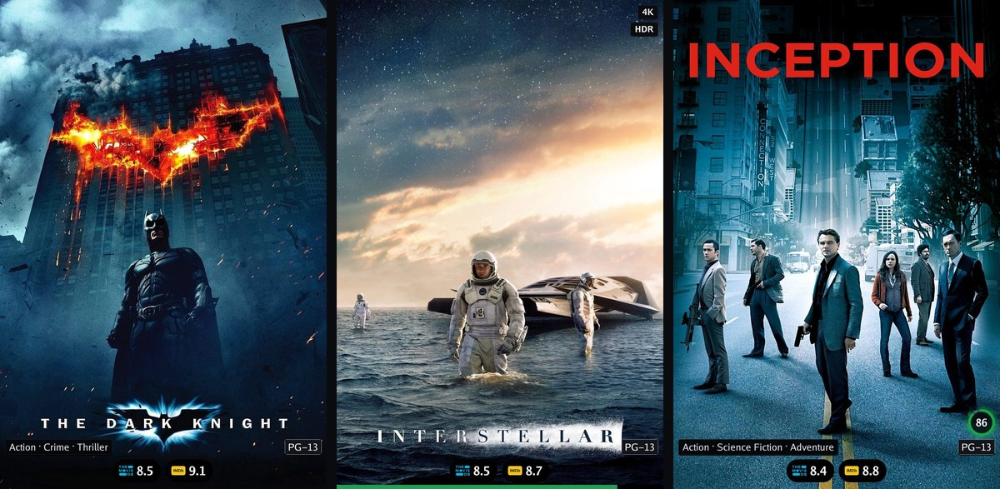
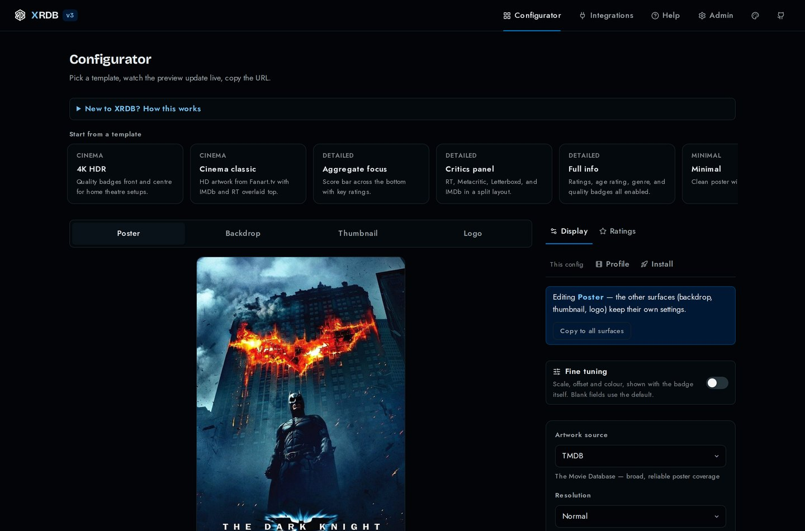

# XRDB — eXtended Ratings DataBase

Ratings overlays and artwork for your media library. XRDB fetches posters,
backdrops, thumbnails, and logos, composes rating badges and metadata onto
them, and serves the result as an image URL — built for Plex, Jellyfin,
Stremio (via AIOMetadata), and anything else that takes one.



- **One container.** The web configurator is embedded in a single Go binary.
- **Fast.** Pure-Go render pipeline with a two-tier (memory + disk) cache.
- **Small.** A default poster is around 38 KB, inside Stremio's 100 KB limit
  and under its 50 KB recommendation. Larger tiers are a setting away.
- **12 rating sources** with official provider logos: IMDb, TMDB, Rotten
  Tomatoes (critics + audience), Metacritic, Letterboxd, MDBList, Trakt,
  SIMKL, MyAnimeList, AniList, Kitsu.
- **Configurable overlays:** rating badges (pill/square/glass, dark/light),
  quality badges (4K/HDR/DV/…), age rating, genres, streaming providers,
  aggregate score bar, trending tag — across normal/large/4K output sizes.
- **Profiles** with memorable aliases and password-protected editing; the
  artwork URL is just `…/poster/{id}?config=your-alias`.

## The configurator

Every control updates the preview immediately, so the look you approve is the
look your whole library takes on.



## Quick start

```sh
docker run -d --name xrdb -p 8787:8787 -v xrdb-data:/data \
  -e XRDB_ADMIN_KEY=choose-a-strong-key \
  ghcr.io/ibbylabs/xrdb:dev
```

v3 ships on `:dev` (port `8787`); `:latest` is still v2 (port `3000`).

Open `http://localhost:8787`, add your provider keys under **Integrations**
(TMDB at minimum), then build your look in the **Configurator** and save it
as a profile. Or with compose: `docker compose up --build`.

Per-client setup: [Stremio](docs/setup/stremio.md) ·
[AIOMetadata](docs/setup/aiometadata.md) ·
[Jellyfin](docs/setup/jellyfin.md) ·
[Emby](docs/setup/emby.md) ·
[Kodi](docs/setup/kodi.md) ·
[Plex](docs/setup/plex.md) — [overview](docs/setup/README.md)

Environment reference: [variables.md](variables.md) ·
Template: [env.template](env.template) ·
Upgrading from v2: [docs/migrating-to-v3.md](docs/migrating-to-v3.md)

## Running locally

```sh
make dev
```

Starts the API on `http://localhost:8787` and the web dev server on
`http://localhost:3001` (provider keys are read from `.env`). Or run them
individually:

```sh
go run ./cmd/api                  # API on :8787 (XRDB_ADDR to change)
cd web && npm ci && npm run dev   # web on :3001
```

## API endpoints

| Method | Path | Description |
|---|---|---|
| `GET` | `/{type}/{id}?config=…` | Render image — `type` is `poster`, `backdrop`, `thumbnail`, or `logo`; `config` is a profile ID, alias, or inline JSON |
| `GET` | `/healthz`, `/readyz` | Health and readiness |
| `GET/POST` | `/profile` | List / create profiles (ID generated when omitted) |
| `GET/PUT/DELETE` | `/profile/{id-or-alias}` | Read / update / delete (password-protected when set) |
| `GET` | `/profile/{id}/export` | Export a profile as JSON |
| `POST` | `/profile/import` | Import profiles from JSON |
| `GET` | `/api/templates` | Built-in config templates |
| `GET` | `/api/search?q=` | Title search (TMDB-backed) |
| `GET` | `/api/trending` | Trending titles |
| `GET` | `/api/lookup?type=&id=` | TMDB ID → IMDb ID |
| `POST` | `/api/aiometadata/install` | One-click AIOMetadata setup |
| `GET` | `/api/admin/metrics`, `/api/admin/cache` | Runtime metrics, cache stats † |
| `DELETE` | `/api/admin/cache[?key=]` | Drop every render, or one by its `X-Cache-Key` † |
| `GET` | `/api/admin/sources` | Per-source health; `staleServes` flags a broken source † |
| `POST` | `/api/admin/warm` | Pre-render IDs into the cache † |
| `GET/PUT/DELETE` | `/api/admin/settings` | Integration keys † |
| `GET` | `/stremio/manifest.json`, `/stremio/meta/…` | Stremio addon, instance default look |
| `GET` | `/stremio/c/{config}/manifest.json`, `/stremio/c/{config}/meta/…` | Stremio addon bound to a saved profile |

† requires `Authorization: Bearer $XRDB_ADMIN_KEY` when configured.

## Migrating profiles from a previous install

```sh
go run ./cmd/migrate -input legacy-profiles.json
```

Converts v2 profiles to the v3 schema with a per-profile report — see the
[migration guide](docs/migrating-to-v3.md).

## Development

```sh
make test       # run all tests
make bench      # render benchmarks
make build-all  # web export + go build (embedded UI)
```

See [CONTRIBUTING.md](CONTRIBUTING.md) for the local setup, the checks CI runs,
and what tends to come up in review.

## Attribution

XRDB reads from third-party data sources. Their terms ask for the following,
reproduced verbatim:


> This product uses the TMDB API but is not endorsed or certified by TMDB.

> Information courtesy of [IMDb](https://www.imdb.com). Used with permission.

IMDb's dataset is licensed for personal and non-commercial use. Run your
instance on that basis.

Ratings sourced from Rotten Tomatoes, Metacritic, Letterboxd, AlloCiné and
Filmweb are read from their public pages, as none of them publishes an API.
They are cached hard and fall back to the last known good value when a source
is unavailable, so XRDB reads each page far less often than once per render.

---

XRDB by [IbbyLabs](https://github.com/IbbyLabs) ·
[Support](https://kofi.ibbylabs.dev) ·
[Discord](https://discord.gg/wPY2pcqjmm)
